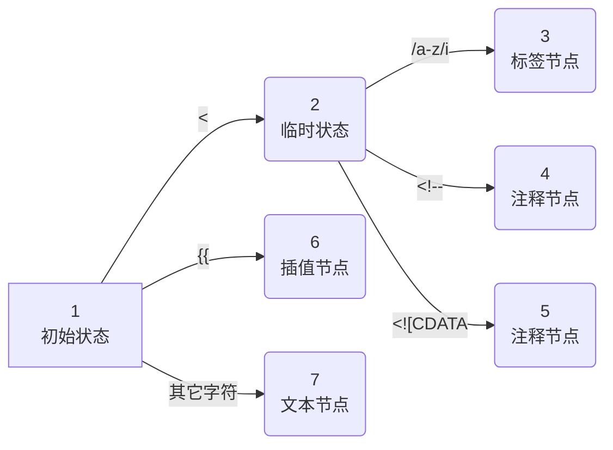

# TDD Vue (4)

> 极客时间前端进阶训练营练习项目—打卡-Day11，2023-1-26

大纲

- [TDD Vue](#tdd-vue)
  - [目标](#目标)
  - [步骤](#步骤)
    - [编写 v0.3 版本](#编写-v03-版本)
  - [效果](#效果)
  - [总结](#总结)

## 目标

- v0.3
  - 增加 parse 实现，实现对 template 解析为 AST

### 编写 v0.3 版本

**为什么？**

编译器是 Vue 的核心功能，主要分为：

1. 解析 template 为 AST；
2. 对 AST 进行转换（可选）；
3. 将 AST 生成为 Javascript 代码。

 template 模板解析，v0.3 版本提供 parse 解析模板中出现的常见元素，返回对应的 ast 节点。


**单元测试**

解析 Element

- 输入：例如 `<div></div>`
- 输出：Element 节点
  - tag: `tagname`
  - type: Element
  - props: `[<propertyarray]`
  - children: `[childrenarray]`
  - isUnary: `true/false` 是否为自闭合节点，例如 `<tagname/>`

```js
it("parse element", () => {
    const template = "<div></div>"
    const ast = parse(template)
    expect(ast[0]).toEqual({
        tag: "div",
        type: "Element",
        props: [],
        children: [],
        isUnary: false,
    })
})
```

解析 Unary Element

- 输入：例如 ``
- 输出：Element 节点
  - tag: `tagname`
  - type: Element
  - props: `[<propertyarray]`
  - children: `[childrenarray]`
  - isUnary: `true`

```js
it("parse unary element", () => {
    const template = ""
    const ast = parse(template)
    expect(ast[0]).toEqual({
        tag: 'img',
        type: 'Element',
        props: [],
        children: [],
        isUnary: true,
    })
})
```

解析嵌套 Element

- 输入：例如 `<div><span></span></div>`
- 输出：Element 节点
  - tag: `tagname`
  - type: Element
  - props: `[<propertyarray]`
  - children: `[childrenarray]`
    - 子节点结构也是元素
  - isUnary: `false`

```js
it("parse nested elements", () => {
    const template = '<div><span></span></div>'
    const ast = parse(template)
    expect(ast[0]).toEqual({
        tag: 'div',
        type: 'Element',
        props: [],
        children: [
            {
                tag: 'span',
                type: 'Element',
                props: [],
                children: [],
                isUnary: false,
            }
        ],
        isUnary: false
    })
})
```

解析 Element 中的 Attribute

- 输入：例如 `<div id="foo" v-show="isShow"></div>`
- 输出：包含 Attribute 的 Element 节点
  - tag: `tagname`
  - type: Element
  - props: `[<propertyarray]`
    - 属性节点包含： type, name, value
  - children: `[childrenarray]`
  - isUnary: `true/false` 是否为自闭合节点，例如 `<tagname/>`

```js
it("parse props and directive", () => {
    const template = '<div id="foo" v-show="isShow"></div>'
    const ast = parse(template)
    expect(ast[0]).toEqual({
        tag: 'div',
        type: 'Element',
        props: [
            {
                type: 'Attribute',
                name: 'id',
                value: 'foo'
            },
            {
                type: 'Attribute',
                name: 'v-show',
                value: 'isShow',
            }
        ],
        children: [],
        isUnary: false
    })
})
```

**实现思路**

- 核心是手工实现 parse() 方法：即提供一个支持 Vue template 到 AST（抽象语法树）的解析器
- 这里采用的办法是状态机：
  - 启动状态机
  - 根据输入的内容，递归解析（需要堆栈），根据条件跳转到对应的处理逻辑：例如 Element 元素, Tag 标签, Attribute 属性, Text 文本, Interpolation text 插值文本
  - 返回单元测试要求的 AST 节点

说明：这里用到的主要技术是文本匹配（正则），在后续笔记中会详细分析。



**核心代码**

传入 template 文本，由于 HTML 是嵌套结构，这里调用 parseChildren 进行递归解析。

- advance()：字符串工具函数，跳过 `num` 个字符
- advanceSpaces()：字符串工具函数，跳过接下来的空格
- source：记录当前待处理的文本

src/compiler/parse.js

```js
export function parse(template) {
    // Context
    const context = {
        source: template, //save template to consume laster
        advance(num) { // consume template content
            // split template based on num, use part at the end, replace context.source
            context.source = context.source.slice(num)
        },
        advanceSpaces() {
            const match = /^[\t\r\n\f ]+/.exec(context.source)
            if (match) {
                context.advance(match[0].length)
            }
        }
    }

    // parse children nodes
    return parseChildren(context, [])
}
```

parseChildren 是实际解析的代码，核心逻辑是根据当前匹配的结果赚到对应的处理函数：

- 处理上下文中的内容 `context.source` 即模板，直到循环结束
  - parseElement()：解析 Element
    - 考虑自闭合标签 isUnary
    - 解析属性 Attribute（包括属性值，属性名，引号等情况）
  - parseInterpolation：解析 ```` 插值文本
  - parseText：解析文本
- 循环结束，返回 AST 节点

```js
function parseChildren(context, stack) {
    let nodes = []
    while (!isEnd(context, stack)) {
        let node
        if (context.source[0] === '<') {
            if (context.source[1] === '/') {
                console.error('invalid end tag')
                continue
            } else if (/[a-z]/i.test(context.source[1])) {
                node = parseElement(context, stack)
            }
        } else if (context.source.startsWith('{{')) {
            node = parseInterpolation(context)
        }
        if (!node) {
            node = parseText(context)
        }
        nodes.push(node)
    }
    return nodes
}
```

## 效果

- [v0.3](https://github.com/tangyouhua/lab-tdd-vue/releases/tag/v0.3)
  - 4 个解析template 单元测试通过

## 总结

- template 通过 parse 解析为 AST 节点，供后续工作使用。利用状态机实现一个简化版的模板解析功能

[1]: https://github.com/tangyouhua/lab-tdd-vue
[doc-tdd]: https://zh.wikipedia.org/wiki/%E6%B5%8B%E8%AF%95%E9%A9%B1%E5%8A%A8%E5%BC%80%E5%8F%91
[doc-jestjs]: https://jestjs.io/zh-Hans/docs/getting-started
[api-js-proxy]: https://developer.mozilla.org/zh-CN/docs/Web/JavaScript/Reference/Global_Objects/Proxy
[doc-vuejs-how-reactivity-works-in-vue]: https://cn.vuejs.org/guide/extras/reactivity-in-depth.html#how-reactivity-works-in-vue
[doc-vuejs-render-pipeline]: https://cn.vuejs.org/guide/extras/rendering-mechanism.html#render-pipeline
[doc-jestjs-fnimpl]: https://jestjs.io/zh-Hans/docs/jest-object#jestfnimplementation
[api-jestjs-jestusefaketimersfaketimersconfig]: https://jestjs.io/zh-Hans/docs/jest-object#jestusefaketimersfaketimersconfig
[api-jestjs-jestrunalltimers]: https://jestjs.io/zh-Hans/docs/jest-object#jestrunalltimers
[extension-vscode-jestrunner]: https://marketplace.visualstudio.com/items?itemName=firsttris.vscode-jest-runner 
