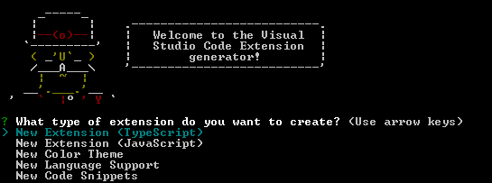

# 脚手架与 CLI

> 极客时间前端进阶训练营—打卡-Day16，2023-1-31

## 是什么

- 脚手架（Scaffolding）：为保证施工过程顺利进行而搭设的平台
- CLI（Command-line Interface）：命令行界面

通常前端脚手架都会和 CLI 工具配合出现。

## 为什么

通过工具减少编写重复工作，包括用到的工具、环境配置等。可以在此基础上直接开始做开发，专注业务。

创建自己的脚手架

- 为项目引入新的通用特性
- 针对构建环境配置优化
- 单元测试等辅助工具代码
- 定制目录结构与通用模板

使用 Yeoman 编写自己的脚手架，可参考[这篇教程](https://yeoman.io/authoring/index.html)。

## 备选方案

根据实际开发项目的需求选择脚手架，著名的脚手架有：

- [vue-cli](https://cli.vuejs.org/zh/)
- [create-react-app](https://create-react-app.dev/)
- [Plop](https://plopjs.com/)
- [Yeoman](https://yeoman.io/)

## 操作实例

以 VS Code Extension 插件开发为例，

```shell
npm install -g yo generator-code
```

这里就用到了 Yeoman 代码生成器，以及针对 VS Code 的插件脚手架 generator-code。

```shell
yo code
```

启动代码生成：



选择完成后会生成：

- VS Code 插件基础的目录结构
- 一个初版 `package.json`
- 插件开发必须的资源，例如 tmBundles, VS Code Library
- 启动插件所需的 launch.json

此外，如果不希望对本机环境有所影响，还可以生成 docker 镜像。

```shell
cd <project directory>
docker build -t vscode-generator-code .
docker run -v $(pwd):/usr/src/app vscode-generator-code
```

**注意**：这里需要项目中有编写好的 Dockerfile。
