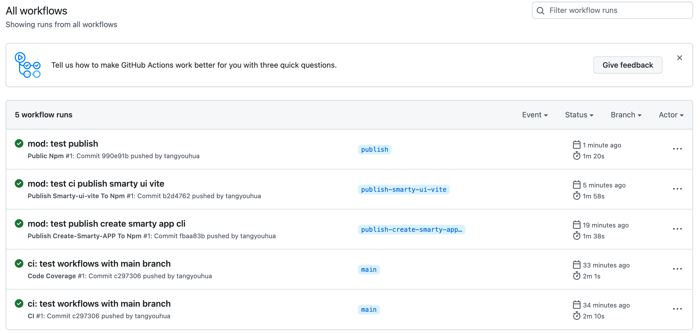
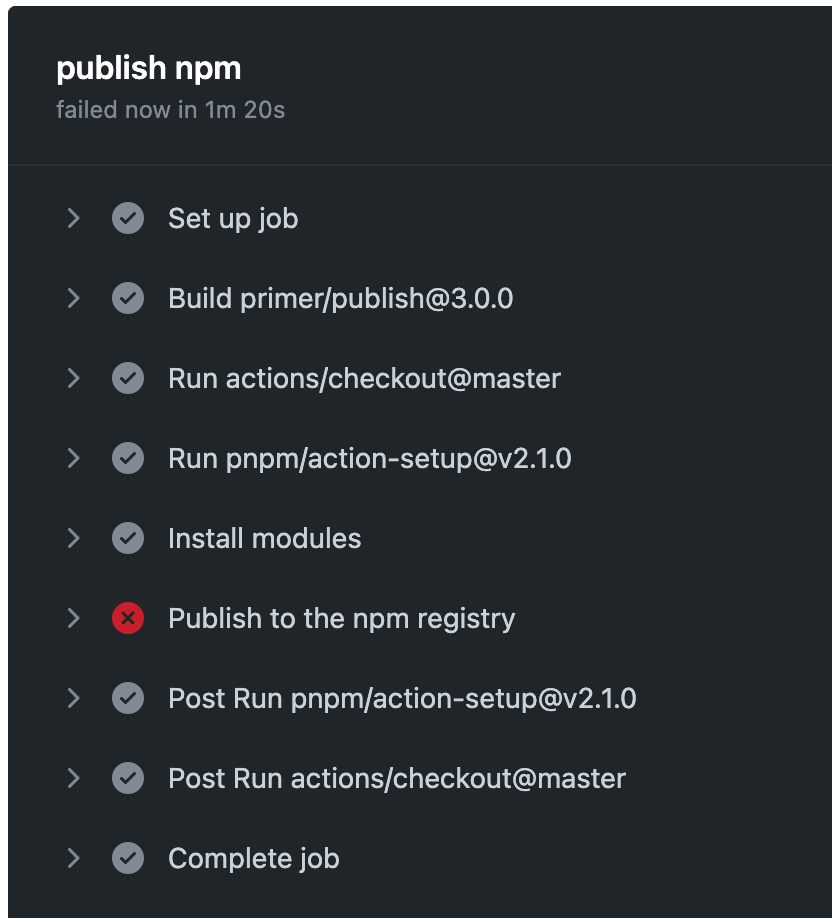
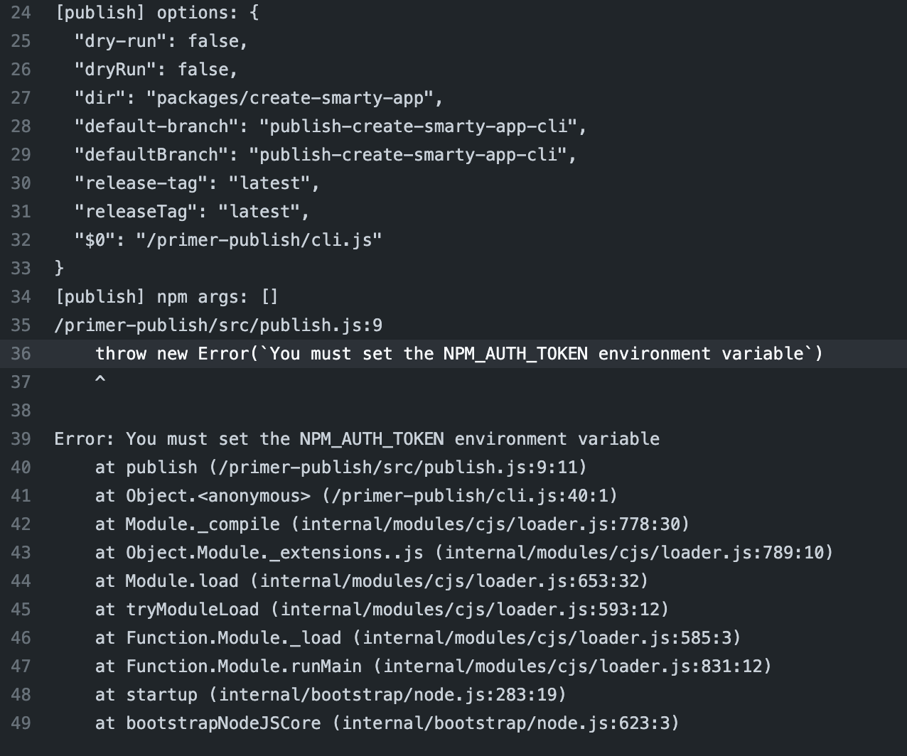
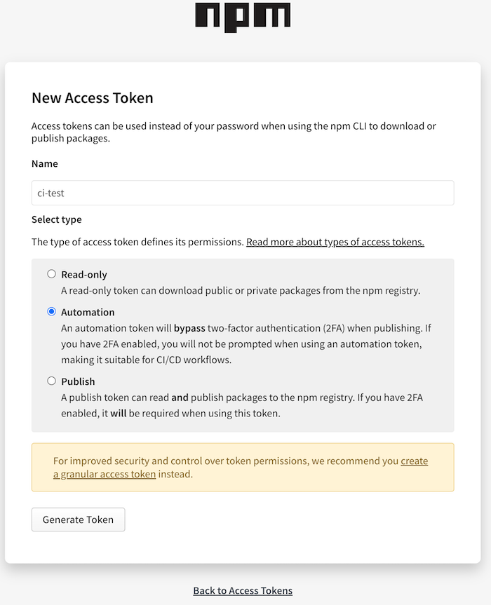
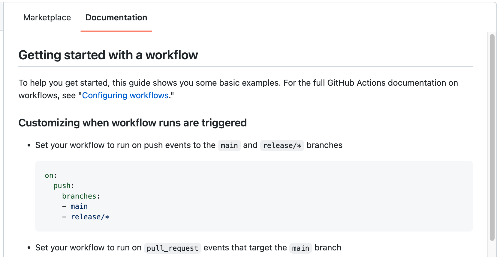
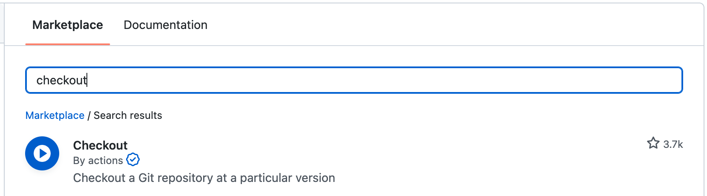
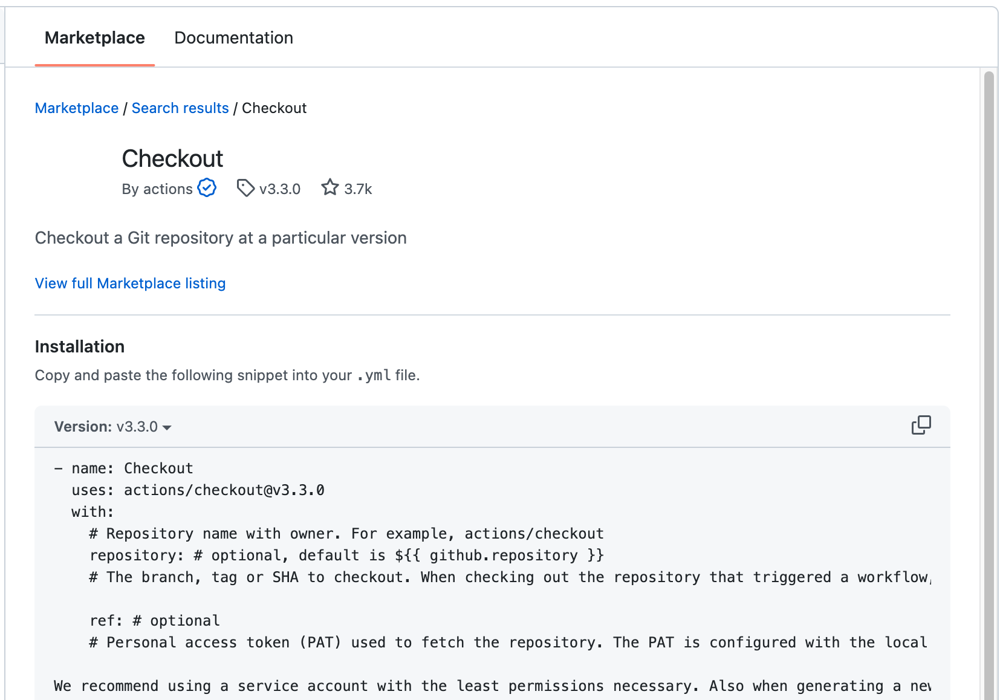

# 持续集成（2）

> 前端进阶训练营笔记-2月打卡-Day16，2023-2-21

## 目标

实验 GitHub Actions。

## 准备

- 从课程提供的官网仓库 fork 一份：[https://github.com/smarty-team/smarty-admin](https://github.com/smarty-team/smarty-admin)
- 准备一个 npmjs.com 的 token，用于发布 workflow
- 在自己的仓库进行以下设置：
    - Actions Tab 页：启用 github actions
    - Settings Tab页：Environment 设置种，为 npm 添加环境变量 NPM_AUTH_TOKEN，内容为 npm token

## 实验

### 理解 workflow 脚本

- 切换到 main 分支
- 查看 .github/workflows 下的 yml 文件

#### codecov.yml

当提交到 main 分支时，使用 pnpm 安装依赖，对 smarty-ui-vite 这个包进行代码覆盖率测试。

```YAML
# .github/workflows/main.yml
# This is a basic workflow to help you get started with Actions

name: Code Coverage

# Controls when the action will run. Triggers the workflow on push or pull request
# events but only for the master branch
on:
  push:
    branches: [main]
  pull_request:
    branches: [main]

# A workflow run is made up of one or more jobs that can run sequentially or in parallel
jobs:
  CodeCov:
    # The type of runner that the job will run on
    runs-on: ubuntu-latest
    # Steps represent a sequence of tasks that will be executed as part of the job
    steps:
      - uses: actions/checkout@v2
      - uses: pnpm/action-setup@v2.1.0
        with:
          version: 7.2.1
      - name: Install modules
        run: pnpm install
      - name: Run Test Coverage
        run: cd packages/smarty-ui-vite && pnpm coverage
      - name: Upload coverage to Codecov
        uses: codecov/codecov-action@v3
        with:
          directory: packages/smarty-ui-vite/coverage
          token: ${{ secrets.CODECOV_TOKEN }}
```

#### main.yml

当提交到 main 分支时，使用 pnpm 安装依赖，对 smarty-ui-vite 这个包进行 lint、单元测试。

```YAML
# .github/workflows/main.yml
# This is a basic workflow to help you get started with Actions

name: CI

# Controls when the action will run. Triggers the workflow on push or pull request
# events but only for the master branch
on:
  push:
    branches: [main]
  pull_request:
    branches: [main]

# A workflow run is made up of one or more jobs that can run sequentially or in parallel
jobs:
  # This workflow contains a single job called "build"
  Lint:
    # The type of runner that the job will run on
    runs-on: ubuntu-latest
    # Steps represent a sequence of tasks that will be executed as part of the job
    steps:
      - uses: actions/checkout@v2
      - uses: pnpm/action-setup@v2.1.0
        with:
          version: 7.2.1
      - name: Install modules
        run: pnpm install
      - name: Run Lint
        run: cd packages/smarty-ui-vite && pnpm run lint
  UnitTest:
    # The type of runner that the job will run on
    runs-on: ubuntu-latest
    # Steps represent a sequence of tasks that will be executed as part of the job
    steps:
      - uses: actions/checkout@v2
      - uses: pnpm/action-setup@v2.1.0
        with:
          version: 7.2.1
      - name: Install modules
        run: pnpm install
      - name: Run Test
        run: cd packages/smarty-ui-vite && pnpm run test:run
  PreBuild:
    # The type of runner that the job will run on
    runs-on: ubuntu-latest
    # Steps represent a sequence of tasks that will be executed as part of the job
    steps:
      - uses: actions/checkout@v2
      - uses: pnpm/action-setup@v2.1.0
        with:
          version: 7.2.1
      - name: Install modules
        run: pnpm install
      - name: Run Lint
        run: cd packages/smarty-ui-vite && pnpm run build

```

#### publish-create-smarty-app.yml

当提交到 publish-create-smarty-app-cli 分支时，使用 pnpm 安装依赖，对 create-smarty-app 这个包进发布到 NPM。

```YAML
name: Publish Create-Smarty-APP To Npm

on:
  push:
    branches: [publish-create-smarty-app-cli]

jobs:
  publish:
    runs-on: ubuntu-latest

    name: "publish npm"

    environment: npm

    steps:
      - uses: actions/checkout@master
      - uses: pnpm/action-setup@v2.1.0
        with:
          version: 6.31.0
      - name: Install modules
        run: pnpm install
      - name: "Publish to the npm registry"
        uses: primer/publish@3.0.0
        env:
          GITHUB_TOKEN: ${{ secrets.GITHUB_TOKEN }}
          NPM_AUTH_TOKEN: ${{ secrets.NPM_AUTH_TOKEN }} # 跟前面步骤中的 NPM_AUTH_TOKEN 保持一致
        with:
          default_branch: "publish-create-smarty-app-cli"
          dir: "packages/create-smarty-app"
          # npm_args: "--unsafe-perm --allow-same-version"

```

#### publish-smarty-ui-vite.yml

#### workflows/publish.yml

这两个workflow 与前面的类似，这里就不做重复分析。

### 测试 workflow

这个步骤比较简单，切换到某个分支，进行简单的修改（例如增加一个测试文件），提交并推送到分支。

打开自己项目的 Actions 页面，可以看到：



当构建出现问题时，可以点击某个出错的 workflow，然后查看出错的原因。





上面的错误是由于缺少环境变量 NPM_AUTH_TOKEN 导致的。

按照实验准备的步骤创建 token 并设置后，可以正常通过。



注意：对于开启了二次验证的情况，需要为 CI/CD 选好正确的设置，否则会因为等待输入二次验证信息而构建失败。

### 了解 GitHub Actions

在 GitHub 上打开某个 workflow 的 yml 文件，点击编辑，可以看到编辑器右侧提供了插件市场与官方文档。

打开文档 Tab 页有教程说明：



在 workflow 中需要利用已有的 action，可以搜索关键词，例如 Checkout。



点击插件可以找到使用示例：



复制粘贴后，根据说明修改参数即可。

此文章为2月Day16学习笔记，内容来源于极客时间《前端进阶训练营》
