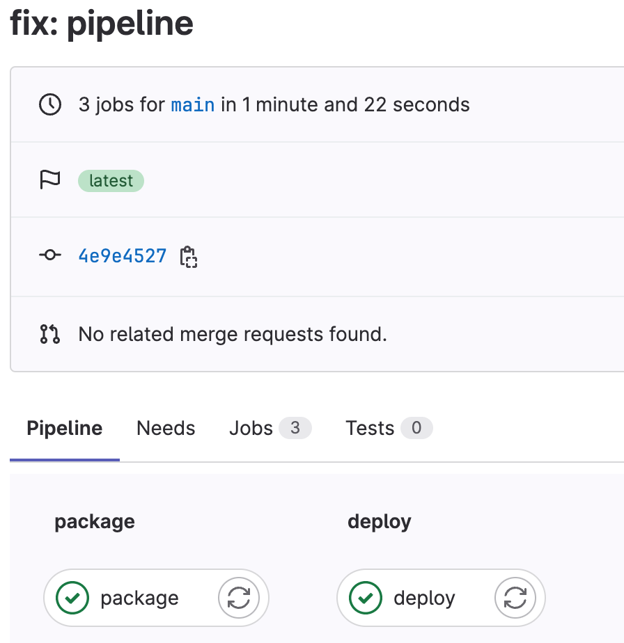

# 持续集成（3）

> 前端进阶训练营笔记-2月打卡-Day17，2023-2-22

## 目标

在 GitLab 上使用 CI/CD 构建、打包并发布一个示例的 npm 包。

## 准备

- 在 GitLab 上新建实验项目：[https://gitlab.com/tangyouhua/lab-gitlab-cicd](https://gitlab.com/tangyouhua/lab-gitlab-cicd)
- 在 npmjs 上注册账户并创建 CI/CD 使用的 token

## 创建 hello-gitlab-cicd 包

新建一个 JavaScript 的 hello gitlab 示例包，步骤如下：

1. npm init：填入项目基础信息
2. 新建 index.js，功能为打印 "Hello, GitLab!"
3. 本地打包与发包测试：npm login，npm publish

发布成功后，可以看到以下信息：

```Bash
% npm view hello-gitlab-cicd 

hello-gitlab-cicd@0.0.1 | ISC | deps: none | versions: 2
A simple hello world package to use gitlab CI/CD
```

注意：如果之前有配置过国内镜像，需要在项目中新建 .npmrc 还原registry。

```Bash
registry=https://registry.npmjs.com/
```

## 编写 gitlab-ci 脚本

编写 CI/CD 脚本目标，当提交到 main 分支时，自动执行下面的命令：

- 打包：npm pack
- 发布：npm publish
    - 自动填写 npm token 实现发布

说明：项目目前比较简单，不涉及构建和测试。

### .gitlab-ci.yml

使用最新的 node 作为镜像，

- 准备动作：npm install
- 执行 package 任务：npm pack
- 执行 deploy 任务：npm publish
    - 触发条件：main 分支

```YAML
image: node:latest

stages:
  - package
  - deploy

before_script:
  - npm install

package:
  stage: package
  script:
    - npm pack

deploy:
  stage: deploy
  script:
    - npm publish
  only:
    - main
```

## 测试

### 触发 pipeline

- 修改 package.json，版本号改为 0.0.2。
- 在 GitLab 上 Settings - CI/CD - Variables，添加环境变量 NPM_TOKEN
- 修改 .npmrc，增加认证的 token，供发布使用

```Bash
registry=https://registry.npmjs.com/
//registry.npmjs.com/:_authToken=${NPM_TOKEN}

```

### commit 并 push 到 main 分支

可以看到 pipeline 执行成功：



查看 0.0.2 版本的包发布成功：

```Bash
% npm view hello-gitlab-cicd 

hello-gitlab-cicd@0.0.2 | ISC | deps: none | versions: 2
A simple hello world package to use gitlab CI/CD
```

此文章为2月Day17学习笔记，内容来源于自己设计的实验。
