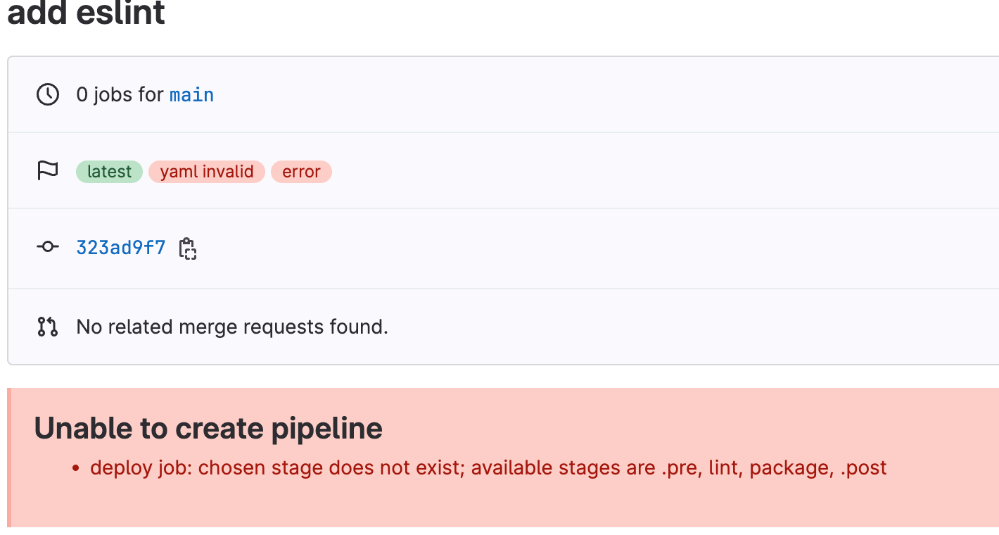
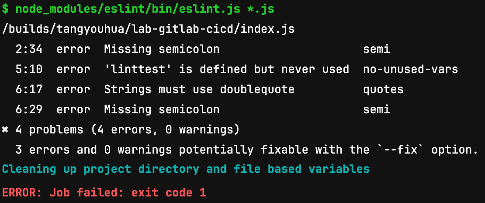
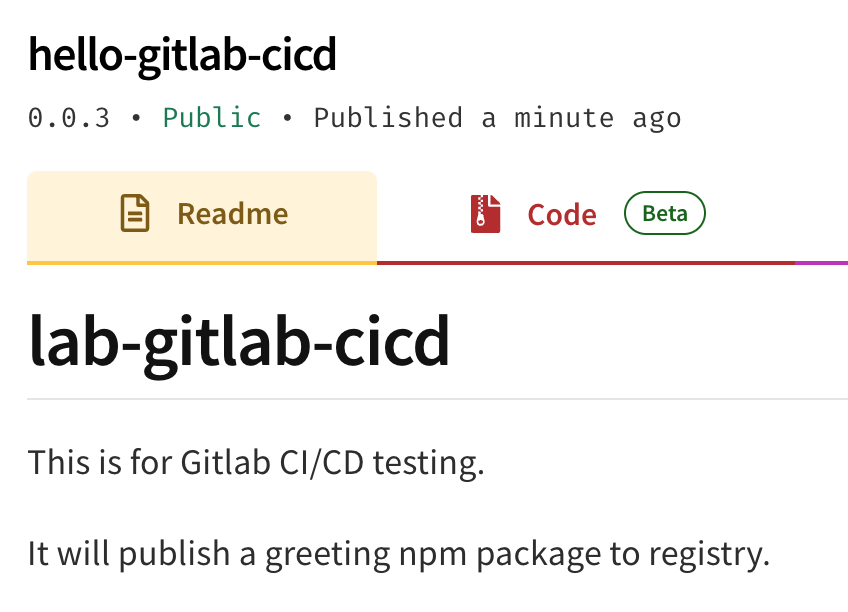

## ESLint 是什么

> 前端进阶训练营笔记-2月打卡-Day19，2023-2-24

官网介绍：[https://eslint.org/](https://eslint.org/)

- 对代码进行静态分析
- 定位并报告问题
- 使用场景
    - 在编辑器中使用
    - 在持续集成pipleline中使用

ESLint 包含以下核心概念（[官方介绍](https://eslint.org/docs/latest/use/integrations)）：

- Rule 规则
- Configuration File 配置文件
    - 可分享的配置
- Plugin 插件
- Parser 解析器
- Custom Processor 自定义处理器
- Formatter 格式化器
- Integration 集成：支持众多的编辑器、构建工具、命令行工具、代码管理工具、测试工具

在 GitHub 上还有很多开源的配置可拿来即用：[https://github.com/dustinspecker/awesome-eslint](https://github.com/dustinspecker/awesome-eslint)

## ESLint 使用

### 安装与初始化 lint

```Bash
npm init @eslint/config
```

注意：执行此命令前，需要准备好一个项目目录，例如 npm package。

- 配置文件：[官方文档](https://eslint.org/docs/latest/use/configure/configuration-files)，支持多种格式
- 语言选项：[官方文档](https://eslint.org/docs/latest/use/configure/language-options)，支持 browser，node，commonjs，es2021等
- 配置规则：[官方文档](https://eslint.org/docs/latest/use/configure/rules)
    - 支持注释方式启用与禁用lint规则
    - 支持插件规则
    - 可以扩展已有规则，例如 extends: "eslint:recommended"
- 配置插件：[官方文档](https://eslint.org/docs/latest/use/configure/plugins)
- 配置解析器：[官方文档](https://eslint.org/docs/latest/use/configure/parser)，也可以定义自己的解析器

高级主题：自定义插件、规则、格式化器、解析器等。

想要深入了解 ESLint 架构，可以参考[官方的介绍](https://eslint.org/docs/latest/contribute/architecture/)。

## 动手实验

快速了解所有 ESLint 功能，可尝试在线版本：[https://eslint.org/play](https://eslint.org/play)

### VS Code 编辑器中使用 ESlint

使用以下 ESlint 配置：

- 运行环境：node，es2021
- 使用规则：继承自 "eslint:recommended"
- 检查的 rule：结尾的分号，字符串必须使用双引号，否则报告错误

```JSON
// .eslintrc.json
{
    "env": {
        "node": true,
        "es2021": true
    },
    "extends": "eslint:recommended",
        "overrides": [
        ],
        "parserOptions": {
            "ecmaVersion": "latest",
            "sourceType": "module"
        },
    "rules": {
        "semi": ["error", "always"],
        "quotes": ["error", "double"]
    }
}

```

### 在命令行使用

指定文件或，支持设置通配符。

```Bash
npx eslint "*.js"
```

如果检查不通过，则报告类似下面的错误：

```Bash
/path-to-lab/lab-eslint/index.js
  1:38  error  Missing semicolon  semi

✖ 1 problem (1 error, 0 warnings)
  1 error and 0 warnings potentially fixable with the `--fix` option.
```

可以手动修改，或加上 `--fix` 选项可自动修复。

### 集成到 GitLab Pipeline

新增 .eslintrc.json，检查功能与本地一致：

```Diff
+++ b/.eslintrc.json
@@ -0,0 +1,22 @@
+{
+    "env": {
+        "es2021": true,
+        "node": true
+    },
+    "extends": "eslint:recommended",
+    "overrides": [],
+    "parserOptions": {
+        "ecmaVersion": "latest",
+        "sourceType": "module"
+    },
+    "rules": {
+        "semi": [
+            "error",
+            "always"
+        ],
+        "quotes": [
+            "error",
+            "double"
+        ]
+    }
+}

```

修改 gitlab-ci.yml，增加lint：

- 安装 eslint
- 对目录下所有 js 文件执行 lint

```Diff
--- a/.gitlab-ci.yml
+++ b/.gitlab-ci.yml
@@ -1,17 +1,23 @@
 image: node:latest
 
 stages:
+  - lint
   - package
   - deploy
 
 before_script:
   - npm install
+  - npm install eslint
+
+eslint:
+  stage: lint
+  script:
+    - node_modules/eslint/bin/eslint.js *.js
```

在 index.js 中新增函数，用来测试 lint：

```Diff
@@ -2,6 +2,11 @@ function greeting() {
     console.log("Hello, GitLab!");
 }
 
+function linttest() {
+    console.log('hi eslint')
+}

```

此时执行 pipeline 会报错：



查看报错信息，lint 检查到4个错误：



修改代码如下：

```Diff
@@ -2,6 +2,11 @@ function greeting() {
     console.log("Hello, GitLab!");
 }
 
+function linttest() {
+    console.log("hi eslint");
+}
+
 module.exports = {
-    hello: greeting
+    hello: greeting,
+    test: linttest
 };
```

测试通过，成功发布：



此文章为2月Day19学习笔记，内容来源于 ESLint 官方文档。
