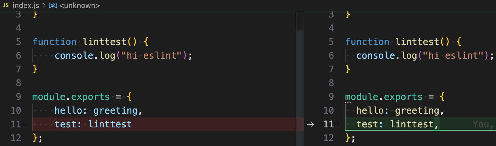
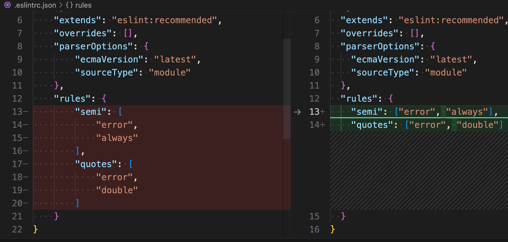
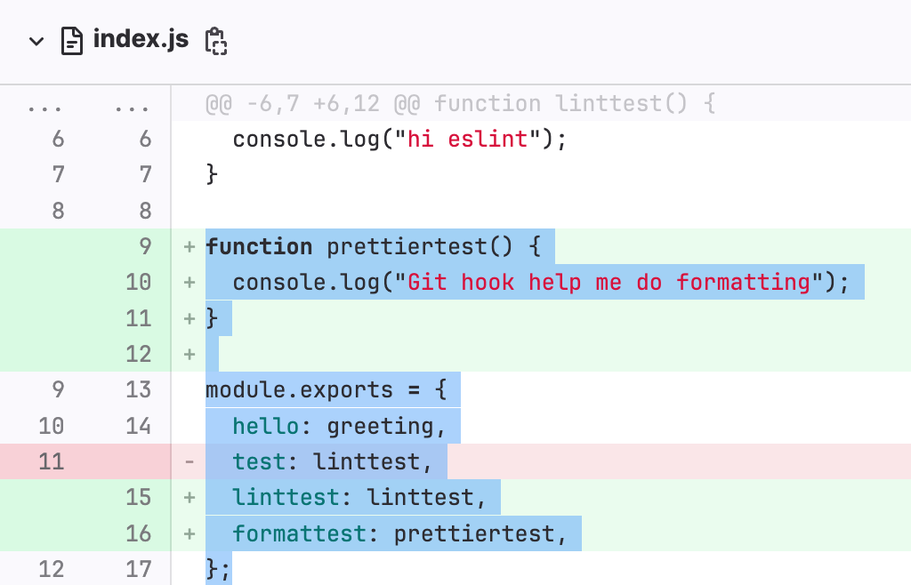

# Prettier 使用

> 前端进阶训练营笔记-2月打卡-Day20，2023-2-25

## Prettier是什么

官网介绍：[https://prettier.io/](https://prettier.io/)

- 代码格式化工具
- 支持多种语言
    - JavaScript：JSX、Flow、TypeScript、JSON
    - HTML：Vue、Angular、Ember / HandleBars
    - CSS：Less、SCSS、styled-components、styled-jsx
    - GraphQL Schemas
    - Markdown：CommonMark、GitHub-Flavored Markdown、MDX
    - YAML
- 社区插件：[官网列表](https://prettier.io/docs/en/plugins.html#community-plugins)
    - Apex
    - Elm（通过 elm-format支持）
    - Java
    - PHP
    - Ruby
    - Rust
    - TOML
    - XML

快速了解 Prettier 可以直接打开网页：[https://prettier.io/playground/](https://prettier.io/playground/)

实现原理是对 AST 处理，详细设计可以查看这篇论文：[A prettier printer](https://homepages.inf.ed.ac.uk/wadler/papers/prettier/prettier.pdf) by Wadler

## 命令行使用 Prettier

### 安装

```Bash
npm install --save-dev --save-exact prettier
```

注意：执行此命令前，需要准备好一个项目目录，例如 npm package。

### 创建配置文件

```Bash
echo {}> .prettierrc.json
```

完整的配置选项可查看官方文档：[https://prettier.io/docs/en/options.html](https://prettier.io/docs/en/options.html)

当然，也可以从已有的项目中拷贝与修改。

### 创建 ignore 文件

```Bash
cat > .prettierignore <<eof
heredoc> # Ignore artifacts:
build
coverage
heredoc> eof
```

### 执行 Prettier

```Bash
npx prettier --write .

```

在示例的 GitLab CI 项目中，结果如下：

```Bash
npx prettier --write .
.eslintrc.json 42ms
.gitlab-ci.yml 32ms
.prettierrc.json 2ms
index.js 12ms
package-lock.json 5ms
package.json 3ms
README.md 38ms
```

查看 Prettier 对不同文件的格式化效果：

index.js



.eslintrc.json



注意：在 CI pipeline 中，要使用下面的命令与参数。对代码格式进行检查，而非修改。

```Bash
npx prettier --check .
```

## 编辑器中使用 Prettier

除了命令行，还可以在你使用的编辑器里配置 Prettier。

[官方文档](https://prettier.io/docs/en/editors.html)中列出了以下支持的编辑器与（插件）设置：

- Visual Studio Code
- Emacs
- Vim
- Sublime Text
- JetBrains WebStorm、PHPStorm、PyCharm等
- Visual Studio
- Atom
- Espresso

例如，在 Visual Studio Code 中：

- 安装 prettier-vscode 插件
- 添加如下配置

```JSON
"editor.defaultFormatter": "esbenp.prettier-vscode",
"[javascript]": {
  "editor.defaultFormatter": "esbenp.prettier-vscode"
},
```
- 执行 Format Document 命令，或者设置文件保存自动格式化选项

## Prettier与 ESlint 适配

执行下面命令，安装 eslint-config-prettier，解决 ESLint 中与 Prettier 冲突的或无效的规则。

```Bash
npm install --save-dev eslint-config-prettier
```

## Git Hook

通过下面的步骤，可以在每次 Git 提交时进行格式化。

1. 安装 husky 和 lint-staged：

```Bash
npm install --save-dev husky lint-staged
npx husky install
npm pkg set scripts.prepare="husky install"
npx husky add .husky/pre-commit "npx lint-staged"
```
2. 在 package.json 中加入下面的内容：

```JSON
{
  "lint-staged": {
    "**/*": "prettier --write --ignore-unknown"
  }
}
```
3. 测试
    1. 关闭 index.js 的保存后自动格式化选项
    2. 增加下面的代码

```JavaScript
function prettiertest() {
  console.log("Git hook help me do formatting")
}

module.exports = {
  hello: greeting,
  linttest: linttest,
formattest: prettiertest
};
```
    3. 提交代码后，发现代码被自动格式化为

```JavaScript
function prettiertest() {
  console.log("Git hook help me do formatting");
}

module.exports = {
  hello: greeting,
  linttest: linttest,
  formattest: prettiertest,
};
```
    4. 查看远程仓库的提交记录，收到的是格式化后的代码

        

## 问题

### Pretter 与 Linter 有什么区别？

来自[官网的说明](https://prettier.io/docs/en/comparison.html)：Linter 有下面两类规则

- 格式化规则：例如 max-len、no-mixed-spaces-and-tabs、keyword-spacing、comma-style等
- 代码质量规则：例如 no-unused-vars、no-extra-bind、no-implicit-globals、prefer-promise-reject-errors等

Prittier 在这两个方面的表现：

- 格式化规则：进行了提升，即对整个程序从头到位进行了格式化，避免程序员犯错
- 代码质量规则：啥也没干

总结一句话，Prettier 专心格式化代码，Linter 用来查找 bug。

### Prettier 所谓的 Option 哲学是什么意思？

选择 Prettier 的最大理由，停止讨论、纠结代码格式而带来的开销。

此文章为2月Day20学习笔记，内容来源于 Prettier 官方文档。
