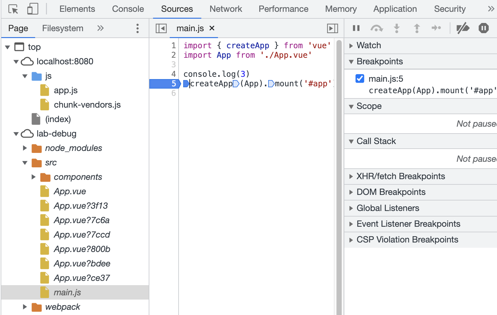

# 前端调试工具

> 前端进阶训练营笔记-2月打卡-Day21，2023-2-26

## 准备工作

本文以一个 Vue 模版项目作为例子，介绍几种前端调试的方法。

- 安装 vue cli
- 创建 lab-debug 项目

```JavaScript
npm install-g @vue/cli
vue create lab-debug -m npm

```

## Source Map

### Source Map 简介

来自《[JavaScript Source Map 详解](https://www.ruanyifeng.com/blog/2013/01/javascript_source_map.html)》by 阮一峰

> 简单说，Source map就是一个信息文件，里面储存着位置信息。也就是说，转换后的代码的每一个位置，所对应的转换前的位置。
有了它，出错的时候，除错工具将直接显示原始代码，而不是转换后的代码。这无疑给开发者带来了很大方便。

### 开启 Source Map

本次实验的项目是 Vue3，更新 `vue.config.js` 内的 `devtool` property：

```JavaScript
module.exports = {
  configureWebpack: {
    devtool: 'source-map'
  }
}
```

编译项目后可以看到生成了后缀名为 `.map` 的文件：

```Bash
pnpm build
tree dist
dist
├── css
│   └── app.2cf79ad6.css
├── favicon.ico
├── index.html
└── js
    ├── app.b22afadd.js
    ├── app.b22afadd.js.map
    ├── chunk-vendors.80e0e50c.js
    └── chunk-vendors.80e0e50c.js.map

```

启动项目：

```Bash
pnpm serve
```

在浏览器中打开项目，启动开发工具，可以看到这样的目录结构：



双击 main.js，可以看到源代码，并支持设置断点。

## 配置 VS Code 远程调试

详细的步骤可参考Vue Cookbook 中的《[在 VS Code 中调试](https://v2.cn.vuejs.org/v2/cookbook/debugging-in-vscode.html)》。

由于前面 Source Map 相关内容已进行介绍，这里开始后续操作：

- 新建 Chrome 调试配置
- 在内容中对 `sourceMapPathOverrides` 选项修改并添加内容如下：

```JSON
{
  "version": "0.2.0",
  "configurations": [
    {
      "type": "chrome",
      "request": "launch",
      "name": "vuejs: chrome",
      "url": "http://localhost:8080",
      "webRoot": "${workspaceFolder}/src",
      "sourceMapPathOverrides": {
        "webpack:///src/*": "${webRoot}/*"
      }
    }
  ]
}
```

上面配置的目的，是让 VS Code 能够找到需要调试的项目，并正确地映射代码位置（基于 Source Map）。

然后，可以在main.js 中设置断点，点击Play按钮启动项目，可查看：

- 断点位置
- 变量信息
- 监视的内容
- 调用堆栈


注意：如果断点不生效，可以用 `npm run serve` 启动。

## 其它调试方式

此外，还可以通过以下方式进行调试：

- 在代码中写 debugger 指令：由于需要修改源代码，且 ESLint 会有冲突，故不做推荐。
- 对 Vue 项目还可以为浏览器添加 [vue.js devtool ](https://devtools.vuejs.org/)插件，类似的其它类型的项目也有对应的调试插件。

最后，调试只是一种手段，优先考虑还是理解代码及生成的日志。

## 彩蛋

对于前端开发，Chrome 提供了很好的调试工具 [Dev Tools](https://developer.chrome.com/docs/devtools/)。

其中不同的面板都有着非常强大的功能，值得学习和练习解决问题。

此文章为2月Day21学习笔记，内容基于极客时间前端训练营。
