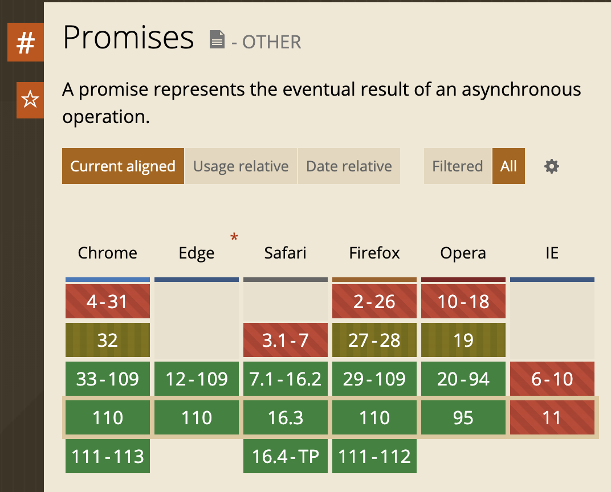

# Polyfill垫片与浏览器兼容

> 前端进阶训练营笔记-2月打卡-Day22，2023-2-27

不同厂家的不同浏览器版本，对 Javascript 的支持程度各有不同。

以`Promise` 为例，如果查阅 [https://caniuse.com/](https://caniuse.com/) 可以看到 IE 的某些版本是不支持的。



垫片的出现，为浏览器兼容提供了解决方案。

## 1、Polyfill 垫片是什么

在 [MDN 的定义](https://developer.mozilla.org/zh-CN/docs/Glossary/Polyfill)中，

> Polyfill 是一块代码（通常是 Web 上的 JavaScript），用来为旧浏览器提供它没有原生支持的较新的功能。

简单的说，就是为本来不支持某个语言特性的程序，通过增加额外的处理提供支持。

## 2、如何启用垫片

### 准备

创建实验项目，安装 babel 相关的包到开发依赖

```Bash
mkdir lab-polyfill
cd lab-polyfill
pnpm init
pnpm install @babel/core @babel/cli @babel/preset-env -D

```

### 配置

创建babel.config.json，当启用 `useBuiltIns` 选项为 "usage" 时，会开启垫片功能。

```JSON
{
  "presets": [
    [
      "@babel/preset-env",
      {
        "targets": {
          "ie": "11"
        },
        "useBuiltIns": "usage",
        "corejs": "3.6.5"
      }
    ]
  ]
}
```

### 代码

```JavaScript
const promiseA = new Promise((resolve, reject) => {
    resolve(777);
  });
// At this point, "promiseA" is already settled.
promiseA.then((val) => document.writeln("asynchronous logging has val:", val));
```

### 验证效果

执行命令：

```Bash
./node_modules/.bin/babel ./src/index.js
```

由于我们选择了 IE 11，所以会生成垫片代码。查看结果：

```JavaScript
"use strict";

require("core-js/modules/es.object.to-string.js");
require("core-js/modules/es.promise.js");
var promiseA = new Promise(function (resolve, reject) {
  resolve(777);
});
// At this point, "promiseA" is already settled.
promiseA.then(function (val) {
  return document.writeln("asynchronous logging has val:", val);
});

```

对比其他选项，比如设置为 Edge 110，则不会添加。结果如下：

```JavaScript
"use strict";

const promiseA = new Promise((resolve, reject) => {
  resolve(777);
});
// At this point, "promiseA" is already settled.
promiseA.then(val => document.writeln("asynchronous logging has val:", val));
```

## 3、Webpack打包

如果需要在打包过程中加入垫片，首先安装打包所需的包：

```Bash
pnpm i babel-loader core-js@3 webpack

```

然后创建 Webpack.config.js 配置文件：

```JavaScript
module.exports = {
  mode: "production",
  module: {
    rules: [
      {
        test: /\.js$/,
        exclude: /(node_modules)/,
        loader: "babel-loader"
      }
    ]
  }
}
```

最后执行打包命令：

```Bash
./node_modules/.bin/webpack ./src/index.js

```

在 dist/main.js 中可以看到支持垫片功能后的打包结果。

此文章为2月Day22学习笔记，内容基于极客时间前端训练营。
