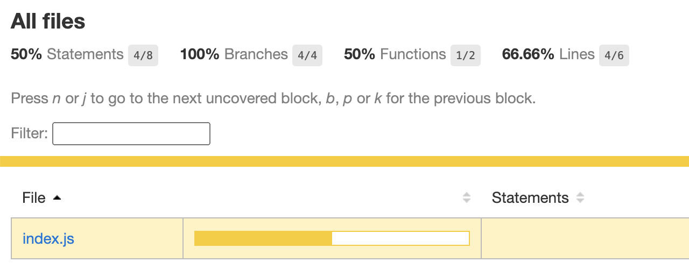
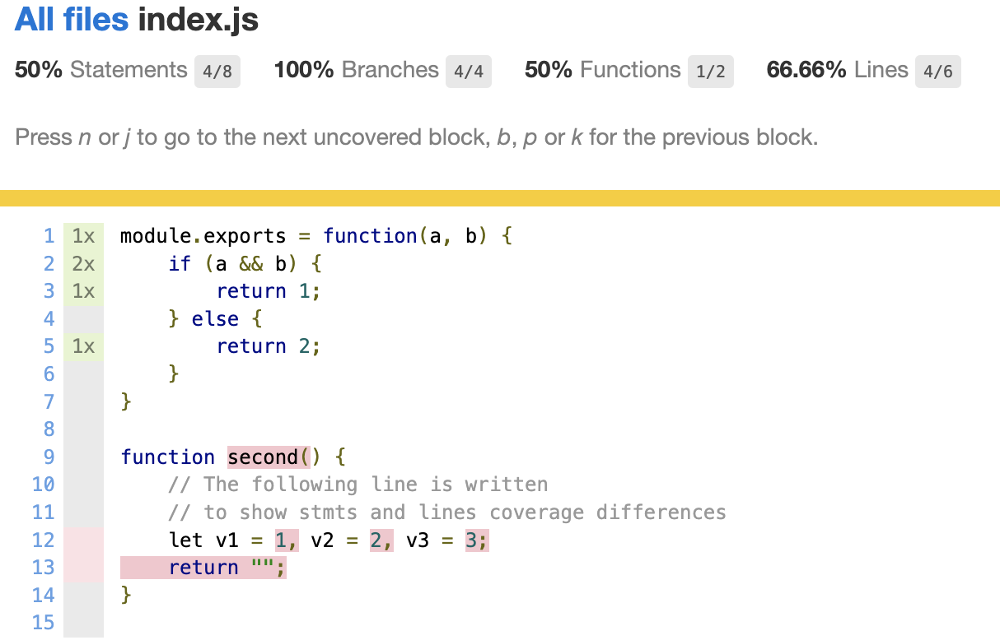

# 使用Jest测试代码覆盖率

> 前端进阶训练营笔记-2月打卡-Day23，2023-2-28

## 什么是代码覆盖率

在软件测试中，代码覆盖率是一个重要的指标，用于衡量测试用例集对被测代码的覆盖程度。常见的代码覆盖率包括语句覆盖、分支覆盖、条件覆盖、路径覆盖等。

代码覆盖率并不是越高越好，需要根据项目的实际情况，例如开发成本、项目进度、质量要求等进行平衡。

本文通过一个示例项目了解如何使用Jest编写单元测试，理解测试覆盖率报告中的数据含义，以及提升单元覆盖率的方法。

## 项目准备

首先，Jest 需要一个包作为环境，进行单元测试。

```Bash
mkdir lab-test-coverage
pnpm init

```

注意：这里的项目目录名称不推荐用`coverage`，因为这个名字会与生成的测试报告重名。

接着，编写项目代码与单元测试：

```JavaScript
// index.js
module.exports = function(a, b) {
    if (a && b) {
        return 1;
    } else {
        return 2;
    }
}

function second() {
    // The following line is written 
    // to show stmts and lines coverage differences 
    let v1 = 1, v2 = 2, v3 = 3;
    return "";
}
```

针对 index 的单元测试：

```JavaScript
// __tests__/index.spec.js
const main = require('../index');
describe('Test coverage demo', () => {
    it('Test main', () => {
        main(true, true);
    });

    it('Test main', () => {
        main(true, false);
    });

});

```

运行单元测试：

```Bash
jest index
 PASS  __tests__/index.spec.js
  Test coverage demo
    ✓ Test main
    ✓ Test main

Test Suites: 1 passed, 1 total
Tests:       2 passed, 2 total
Snapshots:   0 total
Time:        0.324 s, estimated 1 s
Ran all test suites matching /index/i.

```

可以看到，所有的测试都通过了。

## 测试代码覆盖率

测试代码覆盖率

有了前面项目的基础，我们可以直接运行下面的命令来查看代码覆盖率：

```Bash
jest --coverage
 PASS  __tests__/index.spec.js
  Test coverage demo
    ✓ Test main
    ✓ Test main

----------|---------|----------|---------|---------|-------------------
File      | % Stmts | % Branch | % Funcs | % Lines | Uncovered Line #s 
----------|---------|----------|---------|---------|-------------------
All files |      50 |      100 |      50 |   66.66 |                   
 index.js |      50 |      100 |      50 |   66.66 | 12-13             
----------|---------|----------|---------|---------|-------------------
Test Suites: 1 passed, 1 total
Tests:       2 passed, 2 total
Snapshots:   0 total
Time:        0.257 s, estimated 1 s
Ran all test suites.

```

可以看到，这里有 `Stmts`、`Branch`、`Funcs`、 `Lines`四个百分比。

- `Stmts`语句覆盖率
- `Branch`分支覆盖率
- `Funcs` 函数覆盖率
-  `Lines` 行覆盖率

这是命令行中输出的一个精简版的报告。

与此同时，可以看到在项目的根目录下生成了一个 coverage 目录，内容如下：

```Bash
coverage
├── clover.xml
├── coverage-final.json
├── lcov-report
│   ├── base.css
│   ├── block-navigation.js
│   ├── favicon.png
│   ├── index.html
│   ├── index.js.html
│   ├── prettify.css
│   ├── prettify.js
│   ├── sort-arrow-sprite.png
│   └── sorter.js
└── lcov.info
```

在浏览器中打开 index.html，可以看到更详细的报告。



点击 index.js 链接，可以看到更详细的结果：



有了上面的基础，下面来看看如何提升代码覆盖率。

## 提升代码覆盖率

```Bash
----------|---------|----------|---------|---------|-------------------
File      | % Stmts | % Branch | % Funcs | % Lines | Uncovered Line #s 
----------|---------|----------|---------|---------|-------------------
All files |      50 |      100 |      50 |   66.66 |                   
 index.js |      50 |      100 |      50 |   66.66 | 12-13             
----------|---------|----------|---------|---------|-------------------
```

可以看到，函数覆盖率 `Funcs` 是 50%，所以检查代码后发现，可以发现 `second()` 这个函数没有得到测试。可以导出该函数，并在单元测试中增加如下内容：

```JavaScript
// index.js
function main(a, b) {
    if (a && b) {
        return 1;
    } else {
        return 2;
    }
}

function second() {
    // The following line is written 
    // to show stmts and lines coverage differences 
    let v1 = 1, v2 = 2, v3 = 3;
    return "";
}

module.exports = {main, second}

```

单元测试：

```JavaScript
// __tests__/index.spec.js
const mymodule = require('../index');
describe('Test coverage demo', () => {
    it('Test main', () => {
        mymodule.main(true, true);
    });

    it('Test main', () => {
        mymodule.main(true, false);
    });

    it('Test second', () => {
        mymodule.second();
    });
});

```

再次执行代码覆盖率测试：

```Bash
jest --coverage
 PASS  __tests__/index.spec.js
  Test coverage demo
    ✓ Test main (1 ms)
    ✓ Test main
    ✓ Test second

----------|---------|----------|---------|---------|-------------------
File      | % Stmts | % Branch | % Funcs | % Lines | Uncovered Line #s 
----------|---------|----------|---------|---------|-------------------
All files |     100 |      100 |     100 |     100 |                   
 index.js |     100 |      100 |     100 |     100 |                   
----------|---------|----------|---------|---------|-------------------
Test Suites: 1 passed, 1 total
Tests:       3 passed, 3 total
Snapshots:   0 total
Time:        0.343 s
```

此文章为2月Day23学习笔记，内容基于极客时间前端训练营。
