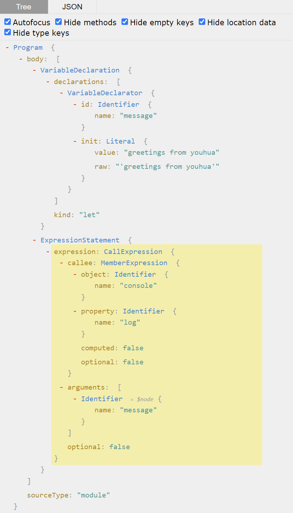

# Mini Rollup（1）

> 前端进阶训练营笔记-2月打卡-Day6，2023-2-11

手写 RollUp，了解其原理。

## 目标

- v0.0
  - 了解 Tree shaking，通过手动解析 AST 理解一个简单的 Treeshaking 案例

### 概念介绍

涉及的概念介绍：

#### Tree shaking

在 MDN 的词汇表中<sup>[1][ref1]</sup>：

> Tree shaking 是一个通常用于描述移除 JavaScript 上下文中的未引用代码 (dead-code) 行为的术语。
> 
> 它依赖于 ES2015 中的 import 和 export 语句，用来检测代码模块是否被导出、导入，且被 JavaScript 文件使用。
> 
> 在现代 JavaScript 应用程序中，我们使用模块打包 (如webpack或Rollup) 将多个 JavaScript 文件打包为单个文件时自动删除未引用的代码。这对于准备预备发布代码的工作非常重要，这样可以使最终文件具有简洁的结构和最小化大小。

[ref1]: https://developer.mozilla.org/zh-CN/docs/Glossary/Tree_shaking

#### 抽象语法 AST

[抽象语法树-wikipedia](https://zh.wikipedia.org/zh-cn/%E6%8A%BD%E8%B1%A1%E8%AA%9E%E6%B3%95%E6%A8%B9)

> 在计算机科学中，抽象语法树（Abstract Syntax Tree，AST），或简称语法树（Syntax tree），是源代码语法结构的一种抽象表示。它以树状的形式表现编程语言的语法结构，树上的每个节点都表示源代码中的一种结构。之所以说语法是“抽象”的，是因为这里的语法并不会表示出真实语法中出现的每个细节。比如，嵌套括号被隐含在树的结构中，并没有以节点的形式呈现；而类似于 if-condition-then 这样的条件跳转语句，可以使用带有三个分支的节点来表示。

比如下面这段 Javascript 代码：

```js
let message = 'greetings from youhua'
console.log(message)
```

打开工具网站，例如 [astexplorer](https://astexplorer.net/)，可以看到对应的抽象语法树。如下图：



这里可以看到，JavaScript AST 遵循 [ECMAScript 语言标准](https://262.ecma-international.org/9.0/#sec-intro)。

如果要了解更多每个 AST 元素的含义，可以在标准文档中搜索。例如，VariableDeclaration 可以在 [Variable Statement](https://262.ecma-international.org/9.0/#sec-variable-statement) 中看到对应的说明。

## 步骤

### 编写 v0.0 版本

要实现一个简单的 Tree shaking 例子，大致需要以下的步骤：

1. 将目标代码转换为 AST；
2. 分析其中需要移除的代码；
3. 输出移除后的结果。

首先，准备实验目录：

```shell
mkdir lab-mini-rollup
cd lab-mini-rollup
mkdir begin
```

接着，准备待测试的代码，其中函数 `b` 没有被调用：

```js
// ./begin/source.js
// Treeshaking
const a = () => 1
const b = () => 2
a()
```

编写测试程序，使用 acorn 将代码转为 AST：

```js
// ./begin/index.js
const fs = require('fs')
const acorn = require('acorn')

const code = fs.readFileSync('./source.js').toString()

const ast = acorn.parse(code, {
    sourceType: 'module',
    ecmaVersion: 7
})

console.log('ast', ast)
```

执行测试程序 index.js，输出 AST 如下：

```shell
% node index.js
ast Node {
  type: 'Program',
  start: 0,
  end: 55,
  body: [
    Node {
      type: 'VariableDeclaration',
      start: 15,
      end: 32,
      declarations: [Array],
      kind: 'const'
    },
    Node {
      type: 'VariableDeclaration',
      start: 33,
      end: 50,
      declarations: [Array],
      kind: 'const'
    },
    Node {
      type: 'ExpressionStatement',
      start: 51,
      end: 54,
      expression: [Node]
    }
  ],
  sourceType: 'module'
}
```

接着，对解析出的 AST 进行分析：

先记录函数声明：

```js
const declarations = {}
ast.body
    .filter(v => v.type === 'VariableDeclaration')
    .map(
        v => {
            console.log('声明', v.declarations[0].id.name)
            declarations[v.declarations[0].id.name] = v
        }
    )
```

再查找函数调用（注意：这里采取了简化写法）：

```js
const statements = []
ast.body
    .filter(v => v.type !== 'VariableDeclaration')
    .map(node => {
        statements.push(declarations[node.expression.callee.name])
        statements.push(node)
    }
    )
```

最后，通过 magic-string 输出 Tree shaking 后的节点为 js 代码：

```js
const m = new MagicString(code)
console.log('-------------')
statements.map(node => {
    console.log(m.snip(node.start, node.end).toString())
})
console.log('-------------')
```

## 效果

- [v0.0](https://github.com/tangyouhua/lab-mini-rollup/releases/tag/v0.0)
  - 执行 `node ./index.js` 可以看到未调用的函数 `b()` 被移除

## 总结

- Tree shaking 是根据 AST 进行分析后，移除无用的代码（AST 节点），demo 中用到了 acorn 做 parser, magic-string 做 AST 到代码转换

此文章为2月Day6学习笔记，内容来源于极客时间《前端进阶训练营》
