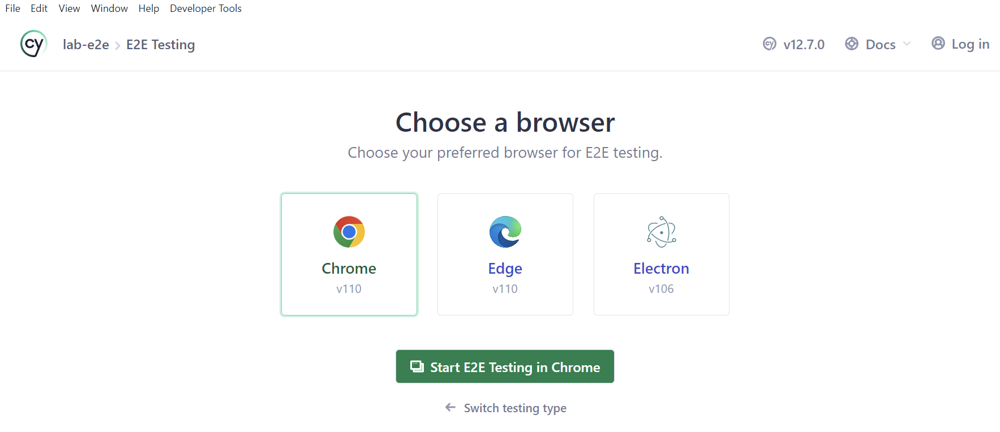
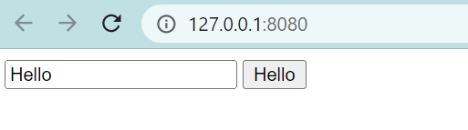
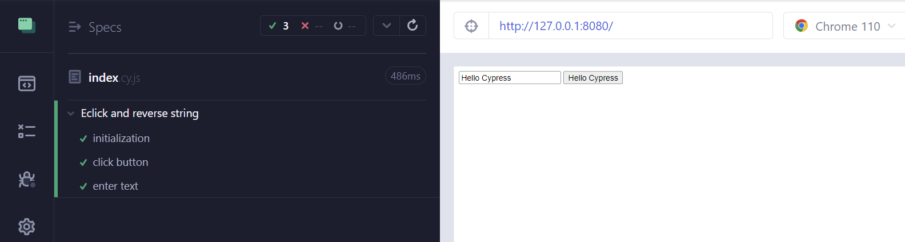

# 使用 Cypress 做E2E端到端测试

> 前端进阶训练营笔记-3月打卡-Day1，2023-3-1

## 有了单元测试为什么还需要E2E测试

E2E测试是端到端测试的缩写，也称为端到端测试、系统测试或黑盒测试。它是一种测试方法，用于测试整个应用程序的功能和性能。

E2E 是单元测试的补充，主要用来解决单元测试无法覆盖到的场景。在E2E测试中，测试人员需要编写测试用例，模拟用户在实际环境下的操作行为，包括输入数据、点击按钮、提交表单等。

E2E测试需要借助一些自动化测试工具来实现，如Cypress、TestCafe、Selenium等。本文使用Cypress 进行讲解。要快速了解 Cypress 的功能，可以在官网的 [Why Cypress](https://docs.cypress.io/guides/overview/why-cypress) 页面观看介绍视频。

## 环境准备

首先，需要建立一个测试的项目，准备好待测试的本地页面。

```Bash
mkdir lab-e2e
cd lab-e2e
pnpm init
pnpm install cypress -D
npx cypress open

```

启动完成，就会看到 Cypress 的主页。



按照向导指引，添加一个 index.cy.js 测试。

注意：如果安装比较慢，可以配置npm为国内镜像。

接着，建立一个功能简单的网页，实现对输入框的文字进行倒序排列。

index.html

```HTML
<!DOCTYPE html>
<html lang="en">

<head>
    <meta charset="UTF-8">
    <meta http-equiv="X-UA-Compatible" content="IE=edge">
    <meta name="viewport" content="width=device-width, initial-scale=1.0">
    <title>Document</title>
</head>

<body>
    <div id="app">
        <input />
        <button></button>
    </div>
    <script>
        const data = {
            message: 'Hello'
        }

        const button = document.querySelector('button')
        const input = document.querySelector('input')

        function update() {
            button.innerHTML = data.message
            input.innerHTML = data.message
        }

        input.addEventListener('keyup', function () {
            data.message = this.value
            update()
        })

        button.addEventListener('click', function () {
            data.message = data.message.split('').reverse().join('')
            update()
        })

        function update() {
            button.innerHTML = data.message
            input.value = data.message
        }

        update()
    </script>
</body>

</html>
```

安装 live-server 并启动：

```Bash
npm install -g live-server
cd lab-e2e
live-server
```

可以看到测试网页：



## E2E测试

下面是几个测试点：

- 能够正常打开 http://localhost:8080 页面，并看到启动效果
- 能够向输入文本框输入数据，模拟点击按钮，并看到字符串翻转后的效果
- 多次点击后，展现的结果按照预期显示

下面开始编写单元测试：

```JavaScript
// cypress\e2e\index.cy.js
describe('Eclick and reverse string', () => {
  beforeEach(() => {
    cy.visit('http://127.0.0.1:8080/')
  })

  it('initialization', () => {
    cy.get("input").should("have.value", "Hello")
    cy.get("button").should("have.text", "Hello")
  })

  it('click button', () => {
    cy.get("button").click();
    cy.get("input").should("have.value", "olleH")
    cy.get("button").should("have.text", "olleH")
  });

  it('enter text', () => {
    cy.get("input").type(" Cypress")
    cy.get("input").should("have.value", "Hello Cypress")
    cy.get("button").should("have.text", "Hello Cypress")
  });
})
```

提示：关于Cypress中用到的 API，可以在[官方的 API 文档](https://docs.cypress.io/api/commands/and)中查阅。

Cypress 是即时执行，可以在测试的浏览器中看到下面的结果：



以上是使用 Cypress 针对示例网页的E2E测试完整流程。

Cypress 还提供了很多其他丰富的功能与资源：

- 端到端测试
    - 一个[完整示例](https://docs.cypress.io/guides/end-to-end-testing/testing-your-app)
    - [AWS](https://docs.cypress.io/guides/end-to-end-testing/amazon-cognito-authentication)、[Auth0](https://docs.cypress.io/guides/end-to-end-testing/auth0-authentication)、[Azure](https://docs.cypress.io/guides/end-to-end-testing/azure-active-directory-authentication)、[GraphQL ](https://docs.cypress.io/guides/end-to-end-testing/working-with-graphql)等云服务的测试策略
- [组件测试](https://docs.cypress.io/guides/component-testing/overview)
- [持续集成](https://docs.cypress.io/guides/continuous-integration/introduction)
- [集成到 IDE](https://docs.cypress.io/guides/tooling/IDE-integration)：例如 VS Code，Intellij

此外，官方文档也提供了一份[最佳实践](https://docs.cypress.io/guides/references/best-practices)。
