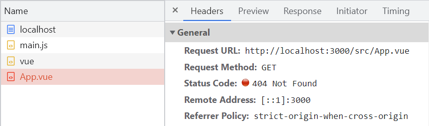
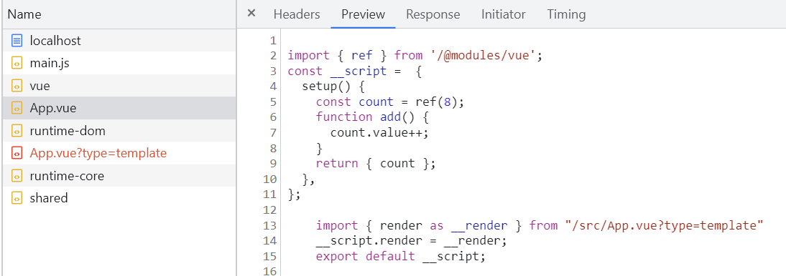
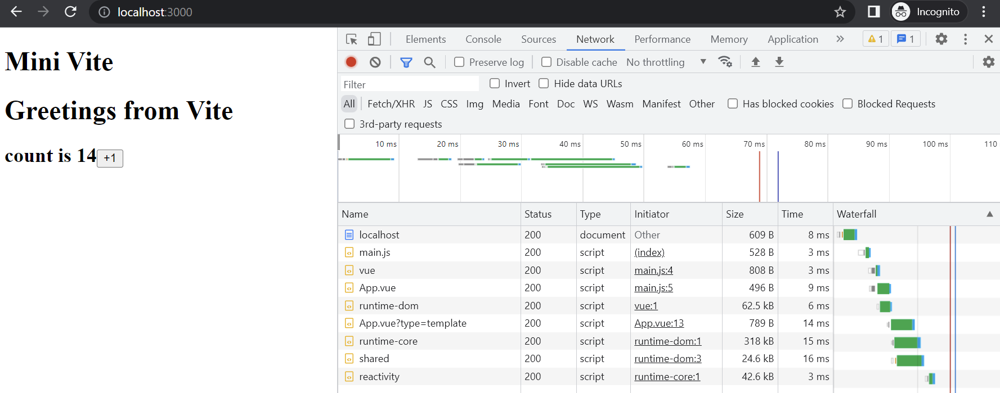

# 手写 Vite（3）：Vue单文件组件支持

> 前端进阶训练营笔记-3月打卡-Day10，2023-3-10

这是手写Vite的第三篇，以 App.vue 为例，介绍 mini Vite 如何支持 Vue 单文件组件。

## 背景知识

下面是[官方文档](https://cn.vuejs.org/guide/scaling-up/sfc.html)对Vue 单文件组件的介绍：

> Vue 的单文件组件 (即 `*.vue` 文件，英文 Single-File Component，简称 **SFC**) 是一种特殊的文件格式，使我们能够将一个 Vue 组件的模板、逻辑与样式封装在单个文件中。

示例 App.vue：

```Vue
<template>
  <div>
    <h1>Greetings from Vite</h1>
    <h2>
      <span>count is {{ count }}</span>
      <button @click="count++">+1</button>
    </h2>
  </div>
</template>

<script>
import { ref } from "vue";
export default {
  setup() {
    const count = ref(8);
    function add() {
      count.value++;
    }
    return { count };
  },
};
</script>

```

在页面上提供一个 `+1` 按钮，点击按钮会增加计数并显示。

## 问题

使用 App.vue：

```JavaScript
// src/main.js
import { createApp, h } from "vue";
import App from "./App.vue";

createApp(App).mount("#app");

```

浏览器报告 “App.vue” 无法加载：



## 准备工作

安装 [vue sfc compiler](https://www.npmjs.com/package/@vue/compiler-sfc)：

```Bash
npm i @vue/compiler-sfc -s -D
```

这个工具可以将 Vue SFC 组件编译为 JavaScript。

## 实现 Vue SFC 组件支持

要支持Vue SFC 组件，需要完成下面的几个步骤：

1. 浏览器能正确地请求到 App.vue 文件；
2. 编译 App.vue，对里面的 Javascript 代码正确加载。这里可复用上一篇的第三方库支持；
3. 对编译结果中的 template 内容进行渲染。

### App.vue 文件请求

通过 `path.resolve` 修改 url 中的路径即可：

```JavaScript
// index.js
app.use(async (ctx) => {
  const { url, query } = ctx.request;
  //...
  if (url.indexOf(".vue") > -1) {
    // support SFC component
    // step 1. *.vue => template script (compiler-sfc)
    // /*.vue?type=template
    const p = path.resolve(__dirname, url.split("?")[0].slice(1));
    //...
  }
}
```

需要注意的是，在上面的第3步是通过 url 跳转实现的，所以路径也要对这种情况进行支持。

### 加载 SFC 中的脚本

我们的目标是，对 App.vue 的脚本能够正确加载：

```JavaScript
<script>
import { ref } from "vue";
export default {
  setup() {
    const count = ref(8);
    function add() {
      count.value++;
    }
    return { count };
  },
};
</script>
```

使用 sfc-compiler 进行编译，产生的内容如下：

```JavaScript
{
  descriptor: {
    filename: 'anonymous.vue',
    source: ...
    template: {
      type: 'template',
      content: '\r\n' +
        '  <div>\r\n' +
        '    <h1>Greetings from Vite</h1>\r\n' +
        '    <h2>\r\n' +
        '      <span>count is {{ count }}</span>\r\n' +
        '      <button @click="count++">+1</button>\r\n' +
        '    </h2>\r\n' +
        '  </div>\r\n',
      ...
    },
    script: {
      type: 'script',
      content: '\r\n' +
        'import { ref } from "vue";\r\n' +
        'export default {\r\n' +
        '  setup() {\r\n' +
        '    const count = ref(8);\r\n' +
        '    function add() {\r\n' +
        '      count.value++;\r\n' +
        '    }\r\n' +
        '    return { count };\r\n' +
        '  },\r\n' +
        '};\r\n',
      ...
    },
    ...
  },
  errors: []
}
```

这里需要注意的是，在使用 sfc-compiler 解析后，正确地对引用的库进行处理：

```JavaScript
// index.js
const compilerSfc = require("@vue/compiler-sfc");

app.use(async (ctx) => {
  const { url, query } = ctx.request;
  //...
  const p = path.resolve(__dirname, url.split("?")[0].slice(1));
  const { descriptor } = compilerSfc.parse(fs.readFileSync(p, "utf-8"));
  if (!query.type) {
    ctx.type = "application/javascript";
    ctx.body = `${rewriteImport(
      descriptor.script.content.replace("export default", "const __script = ")
    )}
  import { render as __render } from "${url}?type=template"
  __script.render = __render;
  export default __script;
  `;
  }
  //...
}   
```

可以看到，上面的代码中，除了进行模板替换，还调用了上一篇中实现的 `rewriteImport `方法。

此外，对于脚本中的脚本也进行了对应的处理：

- `export default` 转换为 `const __script` ；
- 加入了 `__render` 并通过 `url `中的请求类型进行二次处理。

下面是加入 template 处理后的效果：



### template 渲染

最后，对 `App.vue?type=template` 进行处理：

```JavaScript
// index.js
const compilerDom = require("@vue/compiler-dom");

app.use(async (ctx) => {
  const { url, query } = ctx.request;
  //...
  else {
    // step 2. template => render func (compiler-dom)
    const template = descriptor.template;
    const render = compilerDom.compile(template.content, { mode: "module" });
    ctx.type = "application/javascript";
    ctx.body = rewriteImport(render.code);
  }
}
```

从解析的结果中获取 template 部分，并通过 compiler-dom 进行编译。

编译结果`render` 中包含了语法树信息 ast 与编译后的代码 code，这里将 code 进行处理后返回。

现在，可以看到期待的 App.vue 组件被正确加载，点击按钮也可以修改计数。



此文章为3月Day10学习笔记，内容基于极客时间前端训练营。
