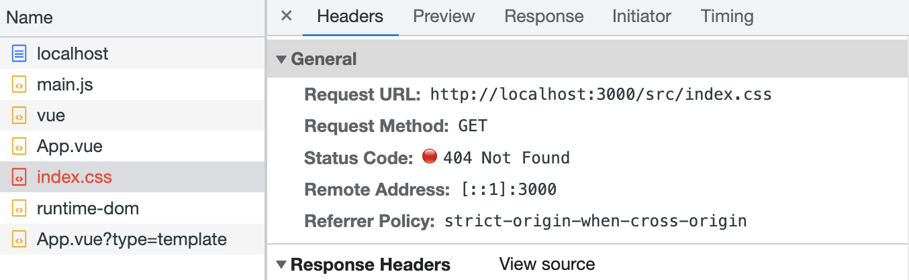
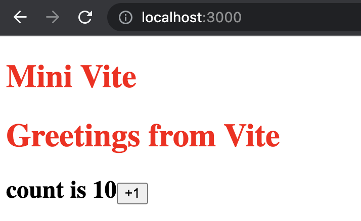

# 手写 Vite（4）：CSS 文件支持

> 前端进阶训练营笔记-3月打卡-Day11，2023-3-11

这是手写Vite的第四篇，介绍 mini Vite 如何支持 CSS 文件。

## 问题

向 mini Vite 项目添加一个简单的 CSS 文件：

```CSS
/* index.css */
h1 {
  color: red;
}

```

```JavaScript
// main.js
import "./index.css";
```

启动项目，默认条件下这个文件不会被加载：



## 实现 CSS支持

思路比较简单，将 CSS 转换为 Javascript：

1. 浏览器能正确地请求到 CSS 文件；
2. 加载 CSS 文件内容，替换其中的换行符；
3. 通过 template 添加 `<script>` 标签，内容为 CSS 代码。

### CSS 文件请求

从上面报错的截图中可以看到，浏览器已经向后端请求了 index.css。

下面需要对文件进行处理：

```JavaScript
// index.js
app.use(async (ctx) => {
  const { url, query } = ctx.request;
  //...
  if (url.endsWith(".css")) {
    //...
  }
}
```

### CSS 文件转 Javascript

- 处理好文件路径，读取后替换其中的换行符；
- 通过字符串模板插入 `<script>` 标签，并填入 CSS 内容。

```JavaScript
// index.js
app.use(async (ctx) => {
  const { url, query } = ctx.request;
  //...
  if (url.endsWith(".css")) {
    const p = path.resolve(__dirname, url.slice(1));
    const file = fs.readFileSync(p, "utf-8");

    const content = `
    const css = "${file.replace(/\n/g, "")}";
    let link = document.createElement('style');
    link.setAttribute('type', 'text/css');
    document.head.appendChild(link);
    link.innerHTML = css;
    export default css;
    `;
    ctx.type = "application/javascript";
    ctx.body = content;
  }
}
```

转换后的效果：



到这里，Vite 支持 CSS 文件的简单版本就完成了。

此文章为3月Day11学习笔记，内容基于极客时间前端训练营。
