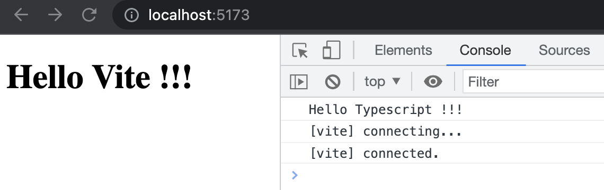
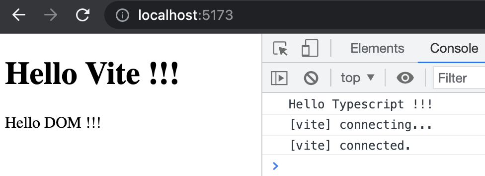

# Admin 项目实战（1）：初始化 Vite 环境

这是 Admin 练习项目的第一篇，练习如何从零开始搭建一个较为复杂项目的 Vite 环境。

> 前端进阶训练营笔记-3月打卡-Day12，2023-3-12

## 基础配置

```Bash
mkdir admin
cd admin
pnpm init
pnpm i vite
pnpm i --save @types/node
npx vite
```

## 加载主页

新建 index.html 内容如下：

```HTML
<!--index.html-->
<!DOCTYPE html>
<html lang="en">
  <head>
    <meta charset="UTF-8" />
    <meta http-equiv="X-UA-Compatible" content="IE=edge" />
    <meta name="viewport" content="width=device-width, initial-scale=1.0" />
    <title>Document</title>
  </head>
  <body>
    <h1>Hello Vite !!!</h1>
  </body>
</html>
```

启动项目可以看到页面正常加载：

## 加载 Typescript 脚本

新建 main.ts 脚本：

```TypeScript
// src/main.ts
const s: string = "Hello Typescript !!!";
console.log(s);
```

并且在 index.html 中加载：

```HTML
<body>
  <h1>Hello Vite !!!</h1>
  <script src="./src/main.ts" type="module"></script>
</body>
```

可以看到 Typescript 脚本可以正确加载：



Vite 可以直接使用 typescript 开发。

注意：Typescript 加载时需要配置 `type="module"` 。

## 加载 DOM

在 HTML 中增加标签：

```HTML
<body>
  <div id="app"></div>
  <script src="./src/main.ts" type="module"></script>
</body>
```

在 main.ts 中修改标签内容：

```TypeScript
import { add } from "~/add";
document.getElementById("app")!.innerHTML = "Hello DOM !!!";
```



加载成功后，可以看到 HelloDOM。

## 配置 Vite.config

这是项目中的重要配置，通过配置 Vite 可以实现模块的别名支持：


```TypeScript
// vite.config.ts
import { defineConfig } from "vite";
import path from "path";

export default defineConfig({
  resolve: {
    alias: {
      "~/": `${path.resolve(__dirname, "src")}/`,
    },
  },
});
```

比如，增加一个 add 函数：

```TypeScript
// src/add.ts
export const add = (a, b) => a + b;

```

修改 main.ts 并调用：

```TypeScript
import { add } from "~/add";
console.log("add(3,3)=", add(3, 3));
```

由于配置了别名，所以 `~/add` 能够正确调用。


此文章为3月Day11学习笔记，内容基于极客时间前端训练营。
