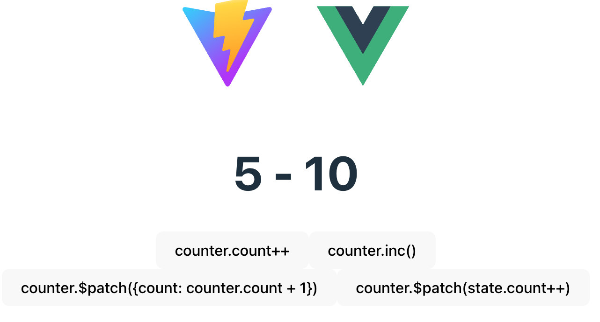

# Pinia初体验

> 前端进阶训练营笔记-3月打卡-Day2，2023-3-2

## Pinia是什么

[官网介绍](https://pinia.vuejs.org/zh/introduction.html)：Pinia 起始于 2019 年 11 月左右的一次实验，其目的是设计一个拥有组合式 API 的 Vue 状态管理库。

## 体验Pinia

首先，用Vite创建一个Hello World项目，并为项目安装Pinia：

```Bash
yarn create vite lab-mini-pinia --template vue
yarn add pinia
```

接着，修改 main.js 添加 Pinia：

- 用`createPinia`创建一个pinia实例
- 通过 `use(pinia)` 加入到`App`

```JavaScript
// src/main.js
import { createApp } from 'vue'
import App from './App.vue'
import { createPinia } from 'pinia'

const pinia = createPinia()

createApp(App).use(pinia).mount('#app')
```

然后，新建 `store/ `目录并加入 `counter.js`：

- 定义 `state` 状态存储，包含 `count`
- 定义 `doubleCounter() `方法，返回 `count*2`
- 定义 `inc() `方法，对 `count`加1

```JavaScript
import { defineStore } from "pinia";

export const useCounterStore = defineStore('counter', {
    state() {
        return {
            count: 1
        }
    },
    getters: {
        doubleCounter(state) {
            console.log(state)
            return state.count * 2
        }
    },
    actions: {
        inc() {
            console.log(this);
            this.count++
        }
    }
})

```

可以看到，这里体现了组合式API的好处，即可以在任意的地方定义（非 `src/ `目录），同时下面会看到统一管理的效果。

最后，修改 HelloWorld 组件：

- 移除原有的功能性代码
- 引入`useCounterStore` 这个存储，命名为 `counter`
- 新建4个按钮，测试4中修改方式
    - 对`count`值直接增加
    - 调用 `inc()` 方法
    - 通过 `patch` 修改 `counter`中的 `count` 属性
    - 通过 `patch` 修改 `state`中的 `count` 属性

```Vue
<script setup>
import { useCounterStore } from '../../store/counter';
const counter = useCounterStore()
</script>

<template>
  <h1>{{ counter.count }} - {{ counter.doubleCounter }} </h1>
  <button @click="counter.count++">counter.count++</button>
  <button @click="counter.inc()">counter.inc()</button>
  <button @click="counter.$patch({count: counter.count + 1})">counter.$patch({count: counter.count + 1})</button>
  <button @click="counter.$patch((state) => state.count++)">counter.$patch(state.count++)</button>
</template>
```

启动项目：

```Bash
yarn add dev
```

点击各个按钮，都可以看到 `count` 加1



## 分析与下一步的行动

可以看到 Pinia 非常简洁，容易上手。从[官方的介绍](https://pinia.vuejs.org/zh/introduction.html)中，Pinia的设计具备以下的特点：

- *mutation* 已被弃用。它们经常被认为是**极其冗余的**。
- 无需要创建自定义的复杂包装器来支持 TypeScript，一切都可标注类型，API 的设计方式是尽可能地利用 TS 类型推理。
- 无过多的魔法字符串注入，只需要导入函数并调用它们，然后享受自动补全的乐趣就好。
- 无需要动态添加 Store，它们默认都是动态的，甚至你可能都不会注意到这点。
- 不再有嵌套结构的**模块**。你仍然可以通过导入和使用另一个 Store 来隐含地嵌套 stores 空间。虽然 Pinia 从设计上提供的是一个扁平的结构，但仍然能够在 Store 之间进行交叉组合。**你甚至可以让 Stores 有循环依赖关系**。
- 不再有**可命名的模块**。考虑到 Store 的扁平架构，Store 的命名取决于它们的定义方式，你甚至可以说所有 Store 都应该命名。

下一步的行动：

- 分析核心API
- 手写mini Pinia，实现核心功能

此文章为3月Day2学习笔记，内容基于极客时间前端训练营。
