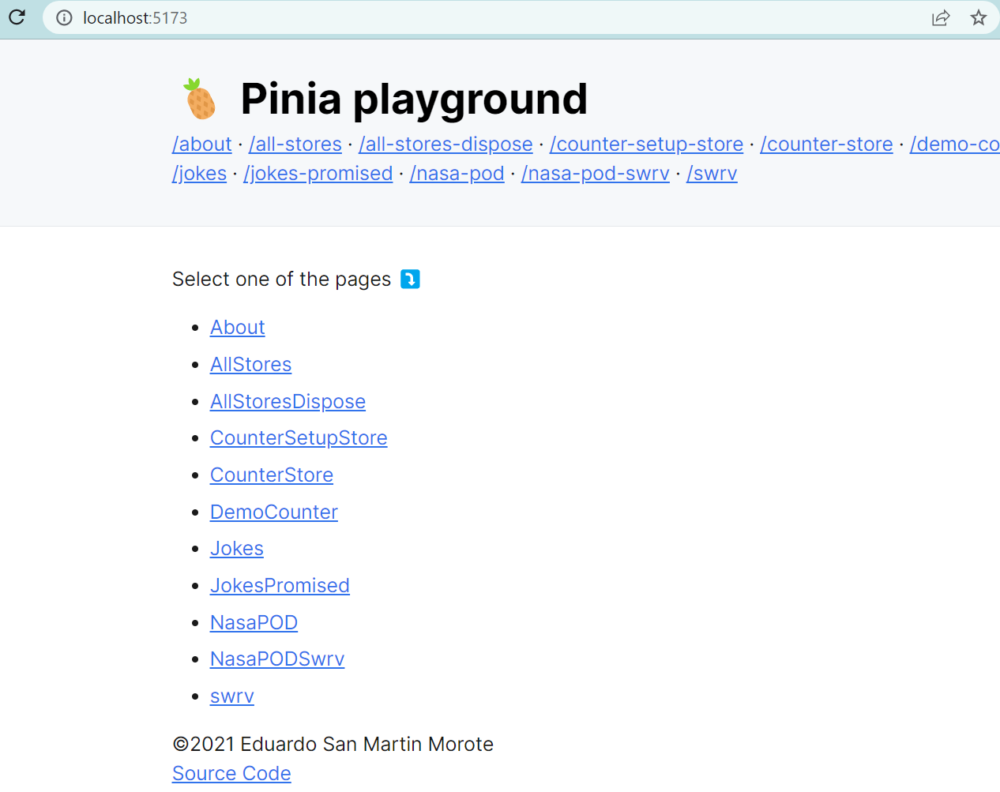
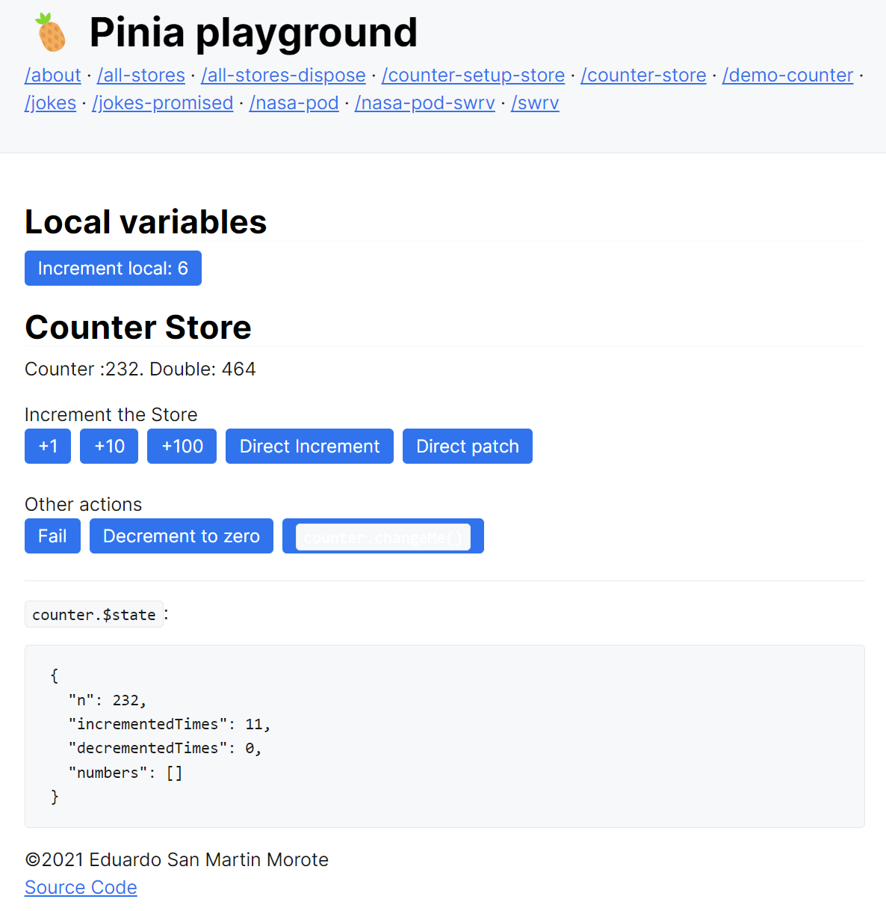

# Pinia 源码分析

> 前端进阶训练营笔记-3月打卡-Day3，2023-3-3

上一篇我们体验了Pinia的主要功能，本文我们开始针对Pinia的源码进行概要分析，为手写Mini Pinia做准备。

## 背景知识

- [Vue3 组件注册](https://vuejs.org/guide/components/registration.html)
- [Options API](https://vuejs.org/api/options-state.html#options-state)
- [Composition API](https://vuejs.org/guide/extras/composition-api-faq.html)

## 代码结构

首先，clone 代码仓库，build，test。

```Bash
git clone https://github.com/vuejs/pinia.git
pnpm install
pnpm build
pnpm test
```

注意：单元测试用到了Linux命令，建议用 Git Bash。

接着，在`packages/` 目录下可以看到 pinia 的源代码：

- createPinia：理解 Pinia 创建
- store：理解 store 定义

```text
packages/pinia/src/
|-- createPinia.ts
|-- devtools
|   |-- actions.ts
|   |-- file-saver.ts
|   |-- formatting.ts
|   |-- index.ts
|   |-- plugin.ts
|   `-- utils.ts
|-- env.ts
|-- global.d.ts
|-- globalExtensions.ts
|-- hmr.ts
|-- index.ts
|-- mapHelpers.ts
|-- rootStore.ts
|-- store.ts
|-- storeToRefs.ts
|-- subscriptions.ts
|-- types.ts
`-- vue2-plugin.ts
```

index 引入并对外提供暴露。

## 理解Pinia创建

### 背景知识effectScope

- `scope.run` 执行时，会搜集所有副作用函数
- `scope.stop` 会清除所有 `watch `

```JavaScript
// packages\pinia\src\createPinia.ts
import { ref, App, markRaw, effectScope, isVue2, Ref } from 'vue-demi'
export function createPinia(): Pinia {
  const scope = effectScope(true)
  // NOTE: here we could check the window object for a state and directly set it
  // if there is anything like it with Vue 3 SSR
  const state = scope.run<Ref<Record<string, StateTree>>>(() =>
    ref<Record<string, StateTree>>({})
  )!

```

### Pinia 实例是一个Vue 组件

实现 `install `方法，使用 `app `实例：

- 保存 `app `到 pinia 实例
- 向下提供 pinia 实例，`app.provide(piniaSymbol, pinia)`
    - 提供给 use `store`方式使用
    - 支持 Vue3 的 composition
- 注册 pinia 实例到 `$pinia`：用  `$pinia` 访问 pinia 属性
    - 暴露给组件的 options API 使用

```JavaScript
// packages\pinia\src\createPinia.ts
export function createPinia(): Pinia {
  const pinia: Pinia = markRaw({
    install(app: App) {
      // this allows calling useStore() outside of a component setup after
      // installing pinia's plugin
      setActivePinia(pinia)
      if (!isVue2) {
        pinia._a = app
        app.provide(piniaSymbol, pinia)
        app.config.globalProperties.$pinia = pinia
        /* istanbul ignore else */
        if (USE_DEVTOOLS) {
          registerPiniaDevtools(app, pinia)
        }
        toBeInstalled.forEach((plugin) => _p.push(plugin))
        toBeInstalled = []
      }
    },
```

### _s 属性

分散定义 store 统一管理：

- 集中放置定义在子模块中的 store
- id 必须唯一

```JavaScript
// packages\pinia\src\createPinia.ts
export function createPinia(): Pinia {
    ...
    _p,
    // it's actually undefined here
    // @ts-expect-error
    _a: null,
    _e: scope,
    _s: new Map<string, StoreGeneric>(),
    state,
  })
```

## 理解 store 定义

### 三种定义方式

- 传递 `id `与 `options`
- 只传 `options`
- 传递 `id `，`storeSetup`与 `options`

### 主要功能

1. 解析参数：根据传入的参数处理，例如 `createSetupStore`，`createOptionsStore`
2. `useStore`：构造或者获取已经存在的 store
    1. 注入 pinia 实例：`_s` 为单例
    2. 初次调用，注册 `store`；否则根据 `id `获取 store，`pinia._s.get(id)`

### 创建细节

- `state `做响应式处理
    - 根据 `id `获取初始值，例如 `store.count` 的初始值 1
    - `Ref `转换成响应式对象
- `getters `转换成响应式
- 提供 `reset `方法清空 store

## 单元测试

下面是 Pinia 仓库中的单元测试，下面是几个示例：

- `stores/` 下是一个用来测试的示例，包括商品和用户存储
- `store.spec.ts` 包含 store相关的单元测试
- `store.patch.spec.ts` 包含 `store.$patch` 单元测试
- `combinedStore.spec.ts` 包含 store组合使用单元测试

```Bash
packages/pinia/__tests__/
|-- actions.spec.ts
|-- combinedStores.spec.ts
|-- getters.spec.ts
|-- hmr.spec.ts
|-- lifespan.spec.ts
|-- mapHelpers.spec.ts
|-- onAction.spec.ts
|-- pinia
|   `-- stores
|       |-- cart.ts
|       |-- combined.ts
|       `-- user.ts
|-- rootState.spec.ts
|-- ssr.spec.ts
|-- state.spec.ts
|-- store.patch.spec.ts
|-- store.spec.ts
|-- storePlugins.spec.ts
|-- storeSetup.spec.ts
|-- storeToRefs.spec.ts
|-- subscriptions.spec.ts
|-- vitest-mock-warn.ts
`-- vitest-setup.ts
```

打开单元测试，可以从单元测试用例学习源码。 

## Playground

此外，还可以通过 Playgound 学习 Pinia，理解单元测试。

在项目根目录，执行下面命令，可以启动本地 Playground。

```Bash
$ pnpm play

> @pinia/root@ play C:\Users\User\code\pinia
> pnpm run -r play

Scope: 6 of 7 workspace projects
packages/playground play$ vite
│   VITE v3.2.4  ready in 339 ms
│   ➜  Local:   http://localhost:5173/
│   ➜  Network: use --host to expose
└─ Running...

```

打开 [http://localhost:5173/](http://localhost:5173/) 可以看到下面的界面：



点击链接，可以查看对应的功能，理解Pinia。例如 counter-setup-store：



Playground 代码可以在 `packages/playground` 中找到。

此文章为3月Day3学习笔记，内容基于极客时间前端训练营。
