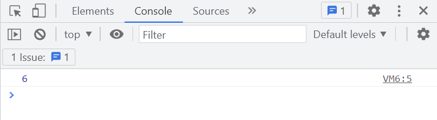
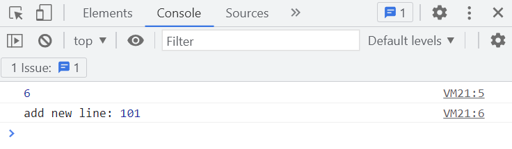

# 手写 Webpack（3）：依赖分析与打包

> 前端进阶训练营笔记-3月打卡-Day7，2023-3-7

上一篇，我们完成了单个模块的 AST 解析与模块分析，成功得到了 module 信息。

本文利用分析出的模块信息生成需要的 Bundle.js。

## 问题描述

### 1、依赖分析

在 `getModuleInfo(file)` 函数的基础上，解析文件返回所有依赖的模块信息。

单个模块信息如下：

```Bash
info {
  file: './src/index.js',
  deps: { './add': '.\\src\\add' },
  code: '"use strict";\n' +
    '\n' +
    'var _add = _interopRequireDefault(require("./add"));\n' +
    'function _interopRequireDefault(obj) { return obj && obj.__esModule ? obj : { "default": obj }; }\n' +
    'console.log((0, _add["default"])(2, 4));'
}
```

### 2、打包到 Bundle 文件

完成依赖分析后，编写模板提供 `require`、`exports` 对象，利用匿名自调用函数与 `eval` 执行代码。

## 核心代码

### 实现依赖分析

通过 `module.deps` 遍历与递归调用，将依赖存储到 `depsGraph` 中。

```JavaScript
// webpack.js
function parseModules(file) {
  const entry = getModuleInfo(file);
  const entries = [entry];
  const depsGraph = {};

  getDependencies(entries, entry);

  entries.forEach((info) => {
    depsGraph[info.file] = {
      deps: info.deps,
      code: info.code,
    };
  });

  return depsGraph;
}

function getDependencies(entries, { deps }) {
  Object.keys(deps).forEach((key) => {
    const child = getModuleInfo(deps[key]);
    entries.push(child);
    getDependencies(entries, child);
  });
}
```

### 实现打包Bundle 文件

核心是编写模板。这里对第一篇文章中的原型稍加改进以便于理解：

```JavaScript
// webpack.js
function bundle(file) {
  const depsGraph = JSON.stringify(parseModules(file));
  return `(function (depsGraph) {
   function require(file) {
     function absoluteRequire(relativePath) {
       return require(depsGraph[file].deps[relativePath]);
     }
     var exports = {};
     (function (require, exports, code) {
       eval(code);
     })(absoluteRequire, exports, depsGraph[file].code)
     return exports;
   }
   require('${file}');
})(${depsGraph});`;
}
```

这里，模板的输入参数为：

- `file` 传入的文件名
- `depsGraph` 依赖分析的结果，存储为 JSON 格式

写入到 `dist/bundle.js`

```JavaScript
const content = bundle("./src/index.js");
!fs.existsSync("./dist") && fs.mkdirSync("./dist");
fs.writeFileSync("./dist/bundle.js", content);
```

下面是生成的示例 bundle.js

```JavaScript
(function (depsGraph) {
   function require(file) {
     function absoluteRequire(relativePath) {
       return require(depsGraph[file].deps[relativePath]);
     }
     var exports = {};
     (function (require, exports, code) {
       eval(code);
     })(absoluteRequire, exports, depsGraph[file].code)
     return exports;
   }
   require('./src/index.js');
})({"./src/index.js":{"deps":{"./add.js":".\\src\\add.js"},"code":"\"use strict\";\n\nvar _add = _interopRequireDefault(require(\"./add.js\"));\nfunction _interopRequireDefault(obj) { return obj && obj.__esModule ? obj : { \"default\": obj }; }\nconsole.log((0, _add[\"default\"])(2, 4));"},".\\src\\add.js":{"deps":{},"code":"\"use strict\";\n\nObject.defineProperty(exports, \"__esModule\", {\n  value: true\n});\nexports[\"default\"] = void 0;\nvar _default = function _default(a, b) {\n  return a + b;\n};\nexports[\"default\"] = _default;"}});
```

## Demo效果

## 1、加载 Bundle

修改 index.html 加载 bundle.js

```HTML
<!--index.html-->
<script src="./dist/bundle.js"></script>
```

在浏览器打开，查看开发工具的 console 窗口：



可以看到示例代码 `add(2, 4)` 输出 `6`。

### 2、修改后重新打包

修改 add.js

```JavaScript
import add from "./add.js";
console.log(add(2, 4));
console.log("add new line:", add(100, 1));
```

重新打包

```Bash
node webpack.js
```

刷新 index.html 查看结果



此文章为3月Day7学习笔记，内容基于极客时间前端训练营。
