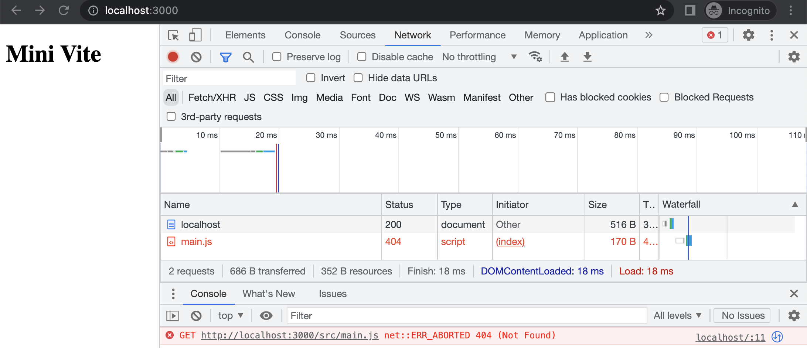
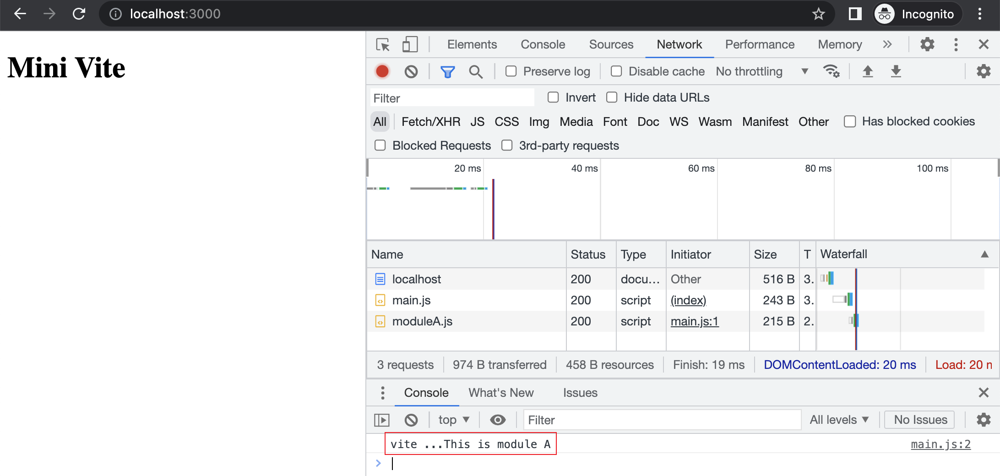

# 手写 Vite（1）：基础功能

> 前端进阶训练营笔记-3月打卡-Day8，2023-3-8

这是手写Vite的第一篇，介绍Vite是什么，对比Webpack有什么区别，最后和以往一样通过实验帮助理解。

## Vite 简介

在Vite的官网中是这么介绍自己的：[https://cn.vitejs.dev/guide/](https://cn.vitejs.dev/guide/)

> Vite（法语意为 "快速的"，发音 `/vit/`，发音同 "veet"）是一种新型前端构建工具，能够显著提升前端开发体验。它主要由两部分组成：
1） 一个开发服务器，它基于 原生 ES 模块提供了丰富的内建功能，如速度快到惊人的 模块热更新（HMR）。
*2）*一套构建指令，它使用 Rollup 打包你的代码，并且它是预配置的，可输出用于生产环境的高度优化过的静态资源。
Vite 意在提供开箱即用的配置，同时它的 插件 API 和 JavaScript API 带来了高度的可扩展性，并有完整的类型支持。

提取一下关键词，就是**快速打包工具**。

## Vite 与 Webpack 的区别

### 构建方式

- Vite采用 ES Module 方式，利用浏览器的支持；
- Webpack 是所有代码打包成一个或多个 bundle。

### 开发体验

- Vite 可以在开发阶段实现按需编译和加载，速度更快；
- Webpack 每次修改代码后都要重新编译和加载整个应用程序。

### 性能

- Vite 开发服务器的启动速度和热重载都比 Webpack 更快。
- 生产环境下，Vite 也能够提供更快的启动速度和更小的应用体积。

### 功能

- Vite 提供了打包工具的常用功能：代码分割、CSS 预处理器、按需加载和热重载等；
- Vite 的限制：可能不支持所有 Webpack 支持的功能和插件。

更多有趣的 Vite 竞品信息可参考官网的[比较文档](https://cn.vitejs.dev/guide/comparisons.html)。

## 实验

### 准备环境

建立项目文件夹，安装 Koa 包，初始化项目。

```Bash
mkdir lab-mini-vite
cd lab-mini-vite
npm install koa -s
npm init
```

### 编写测试代码

main.js 加载 moduleA：

```JavaScript
// src/main.js
import { str } from "./moduleA.js";
console.log("vite ..." + str);

// src/moduleA.js
export const str = "This is module A";

```

index.html 加载 main.js：

```HTML
<!DOCTYPE html>
<html lang="en">
  <head>
    <meta charset="UTF-8" />
    <meta http-equiv="X-UA-Compatible" content="IE=edge" />
    <meta name="viewport" content="width=device-width, initial-scale=1.0" />
    <title>Document</title>
  </head>
  <body>
    <h1>Mini Vite</h1>
    <script src="./src/main.js" type="module"></script>
  </body>
</html>
```

这里需要注意的是增加了 `type="module"` 属性，告诉浏览器按照 module 模式加载。

### 实现基础功能

#### Web 服务

编写 index.js 加入中间件，对根目录请求返回 index.html 内容：

```JavaScript
const Koa = require("koa");
const fs = require("fs");
const app = new Koa();

app.use(async (ctx) => {
  const { url, query } = ctx.request;
  if (url === "/") {
    ctx.type = "text/html";
    const content = fs.readFileSync("./index.html", "utf-8");
    ctx.body = content;
  }
});

app.listen(3000, () => {
  console.log("Vite is listening on port 3000");
});

```

注意：这里由于是实验，所以采用 `fs.readFileSync `忽略性能要求。

#### 加载 Javascript  问题

通过 `nodemon` 启动本地服务，监听 3000 端口：

```Bash
cd lab-mini-vite
nodemon index.js
```

这时会发现 main.js 没有正确加载：



这是因为在代码中，用到了 `./src/main.js` 这样的路径，而请求的是 `/src/main.js`。

#### 转换 Javascript 资源路径

使用 `path` 进行路径转换：

```JavaScript
const fs = require("fs");
const path = require("path");

app.use(async (ctx) => {
  const { url, query } = ctx.request;
  if (url === "/") {
    ctx.type = "text/html";
    const content = fs.readFileSync("./index.html", "utf-8");
    ctx.body = content;
  } else if (url.endsWith(".js")) {
    // /src/main.js => <path>/src/main.js
    const _path = path.resolve(__dirname, url.slice(1));
    const content = fs.readFileSync(_path, "utf-8");
    ctx.type = "application/javascript";
    ctx.body = content;
  }
});

```

注意：这里由于是实验，所以采用 `fs.readFileSync `忽略性能要求。

正确转换后，可以在 console 中看到期待的输出。



到这里，我们实现了模拟 Vite 的加载过程。

此文章为3月Day8学习笔记，内容基于极客时间前端训练营。
