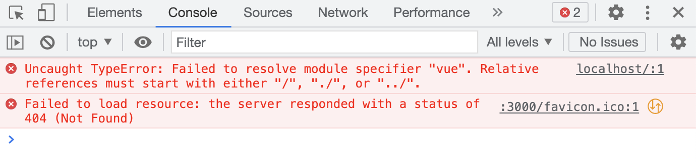
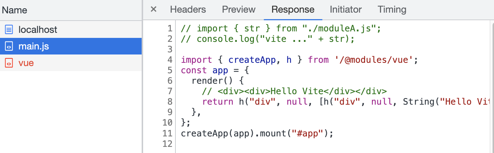
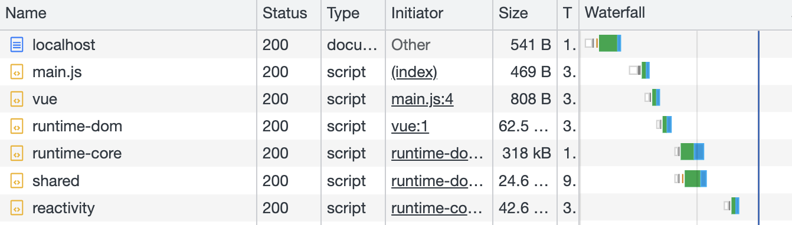
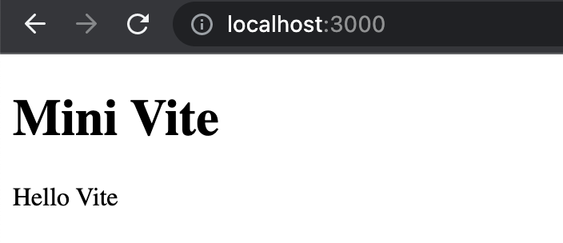

# 手写 Vite（2）：第三方库支持

> 前端进阶训练营笔记-3月打卡-Day9，2023-3-9

这是手写Vite的第二篇，以 vue 为例，通过实例介绍 mini Vite 如何实现第三方库支持。

## 问题

使用 vue，加载后报告 “vue” 无法识别：



浏览器默认情况下，对 `import {createApp, h} from 'vue'` 这样的写法不支持。

那么该怎么做？

## 准备工作

安装 vue：

```Bash
npm install @vue/next -s
```

修改代码，使用 vue 在 index.html 中显示 “hello vite”：

- index.html 加入 id 为 app 的 `<div>`
- main.js 使用 vue `h` 函数构建 “Hello Vite”

```HTML
 <!--index.html-->
<body>
  <h1>Mini Vite</h1>
  <div id="app"></div>
  <script src="./src/main.js" type="module"></script>
</body>
```

```JavaScript
// main.js
import { createApp, h } from "vue";
const app = {
  render() {
    // <div><div>Hello Vite</div></div>
    return h("div", null, [h("div", null, String("Hello Vite"))]);
  },
};
createApp(app).mount("#app");
```

## 实现第三方库支持

要支持第三方库，以 vue 为例，需要完成下面的几个步骤：

- 浏览器加载时向后端请求资源；
- 请求的资源能够正确找到 vue 对应的 ES Module 代码，同时正确加载 vue 用到的依赖；
- 模拟 vue 中用到的 node 环境变量。

### 匹配并重写 import 语句

- 通过 Koa 处理传入的内容，对 `from 'vue'` 这样的写法通过正则表达式进行替换；
- 在返回 `.js`  文件时，加上重写函数 `rewriteImport`。

```JavaScript
// index.js
app.use(async (ctx) => {
  // ...
  else if (url.endsWith(".js")) {
    // /src/main.js => <path>/src/main.js
    const _path = path.resolve(__dirname, url.slice(1));
    const content = fs.readFileSync(_path, "utf-8");
    ctx.type = "application/javascript";
    ctx.body = rewriteImport(content);
  }
  //...
  // hack request: 'vue' => /@modules/vue => alias
  function rewriteImport(content) {
    return content.replace(/ from ['|"]([^'"]+)['|"]/g, function (s0, s1) {
      if (s1[0] !== "." && s1[1] !== "/") {
        return ` from '/@modules/${s1}'`;
      } else {
        return s0;
      }
    });
  }
```

重新加载主页，可以看到 import 被重写为 `/@modules/vue`。



### 解析到 node_modules

- 对于重写为 `/@modules` 开头的语句替换为正确的路径；
- 替换时，需要正确找到 ES Module 对应的文件。

在 vue 的 package.json 中，可以看到下面的内容：

```JSON
"main": "index.js",
"module": "dist/vue.runtime.esm-bundler.js",
```

其中 `module` 的值代表了 ES Module 路径。

接下来就是使用 `path` 正确地拼接 vue module 的绝对路径。

```JavaScript
 // index.js
 app.use(async (ctx) => {
    // ...
    } else if (url.startsWith("/@modules")) {
    // 3rd-party libraries
    // /@modules/vue => vue es module entry in node_modules/
    const prefix = path.resolve(
      __dirname,
      "node_modules",
      url.replace("/@modules/", "")
    );
    const module = require(prefix + "/package.json").module;
    const p = path.resolve(prefix, module);
    const ret = fs.readFileSync(p, "utf-8");
    ctx.type = "application/javascript";
    ctx.body = rewriteImport(ret);
  }
```

这里要注意：很多三方库自己也有依赖，所以这里要一并修改。

重新加载页面，可以看到 `vue` 、`runtime-dom` 、`runtime-core` 都正确加载了。



### 模拟环境变量

vue 这个库比较特殊，里面包含了 `process.env` 这样的代码，浏览器不能识别。

于是，我们需要在 html 加载 <script> 标签的地方插入模拟的环境变量。

```JavaScript
// index.js
app.use(async (ctx) => {
  const { url, query } = ctx.request;
  if (url === "/") {
    ctx.type = "text/html";
    let content = fs.readFileSync("./index.html", "utf-8");
    content = content.replace(
      "<script",
      `<script>window.process={env:{NODE_ENV:'dev'}}</script><script`
    );
    ctx.body = content;
  } 
```

重新加载页面，可以看到 vue 正确加载，并显示 “Hello Vite”。



到这里，加载第三方库的支持已实现。
        
此文章为3月Day9学习笔记，内容基于极客时间前端训练营。
