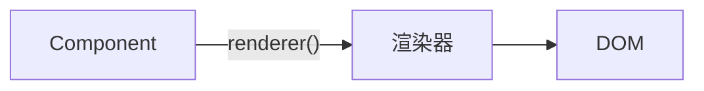
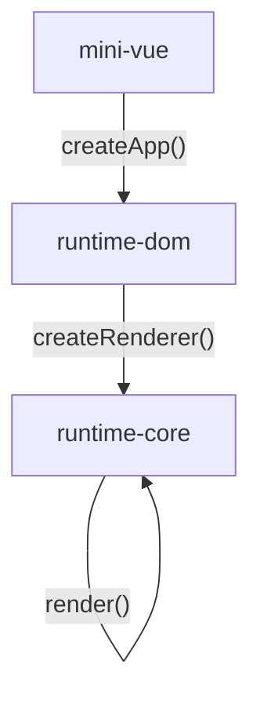

# 动手实验 mini-vue（2）

> 极客时间前端进阶训练营笔记—Day5，2023-1-10

## 大纲

- [x] v0.1
  - 创建实例 `createApp(App)`
  - `app.mount('#app')
- [x] v0.2
  - 创建渲染器 renderer：`createRender()`
  - 提供 render：`renderer.render`
- v0.3
  - 引入 reactive 机制
  - 实现依赖搜集
- v0.4
  - 引入虚拟 DOM：`createVNode`
  - patch 算法

## 目标

- 完成 v0.2 版本

## 步骤

1. 编写 v0.2 版本
2. 重构到 vue-dom, vue-core

### 编写 v0.2 版本

**是什么？**

渲染器是一台机器，将传入的组件转换为 DOM。



**实现思路**

- 提供渲染器工厂 `createRenderer()`
- 提供 `createApp()` 创建渲染器实例 `render`

**核心代码**

调用逻辑



createApp

- 实现 renderer 单例
- 支持平台无关，抽象出 `rendererOptions`，提供 DOM 实现

```js
// runtime-dom
import { createRenderer } from "../runtime-core";

let renderer; // 全局单例

// DOM 平台特有的节点操作
const rendererOptions = {
    querySelector(selector) {
        return document.querySelector(selector)
    },
    insert(child, parent, anchor) {
        // 设置为null则调用appendChild
        parent.insertBefore(child, anchor || null)
    }
}

function ensureRenderer() {
    return renderer || (renderer = createRenderer(rendererOptions))
}

// 创建App实例
export function createApp(rootComponent) {
    //接收根组件，返回App实例
    return ensureRenderer().createApp(rootComponent)
}
```

createRenderer

- 针对传入的组件 `rootComponent` 针对指定目标 `selector` 进行渲染
- 返回渲染器 renderer

```js
export function createRenderer(options) {
    // render负责渲染组件内容
    const render = (rootComponent, selector) => {
        // 1.获取宿主
        const container = options.querySelector(selector)
        // 2.渲染视图
        // call指定数据上下文
        const el = rootComponent.render.call(rootComponent.data())
        // 3.追加到宿主
        options.insert(el, container)
    }

    // 返回一个渲染器实例
    return {
        render,
        // 提供给用户一个createApp方法
        createApp: createAppAPI(render)
    }
}

export function createAppAPI(render) {
    return function createApp(rootComponent) {
        const app = {
            mount(selector) {
                // console.log('mount!')
                render(rootComponent, selector)
            }
        }
        return app
    }
}
```

## 效果

- [v0.2][5]：保持原有效果，实现 createApp 调用渲染器，拆分 vue-dom, vue-core

## 总结

- mini-vue 提供与平台无关的 createRenderer
- runtime-dom 提供 DOM render 单例实现

[1]: https://github.com/tangyouhua/lab-mini-vue
[2]: https://cn.vitejs.dev/guide/#scaffolding-your-first-vite-project
[3]: https://github.com/tangyouhua/lab-mini-vue/releases/tag/v0.0
[4]: https://github.com/tangyouhua/lab-mini-vue/releases/tag/v0.1
[5]: https://github.com/tangyouhua/lab-mini-vue/releases/tag/v0.2
